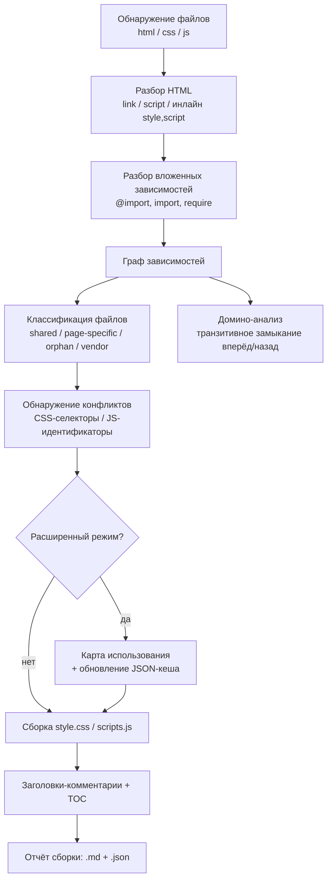
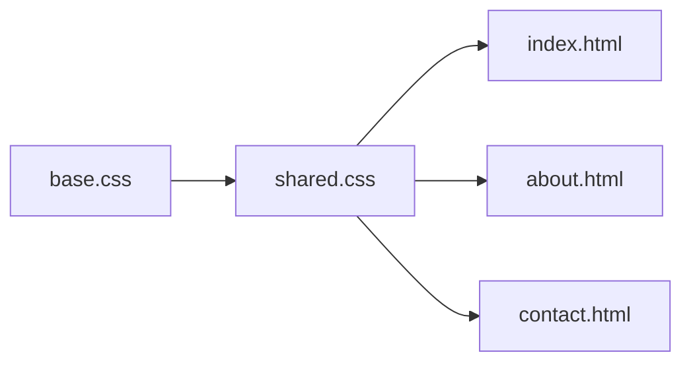

# Техническое задание: `assets-builder.py`

**Сборка и документированное объединение CSS/JS файлов front-end шаблона в два дистрибутивных файла**

> Версия документа: 1.0 · Дата: 2026-08-18
> Статус: аналитика и требования готовы, реализация не начата
> Смежный документ: `TZ-assets-builder-skill.md` — этот скрипт проектируется как самостоятельный CLI-инструмент, который **также** вызывается изнутри LLM-скила `assets-builder` (см. смежный документ) вместо того, чтобы логика парсинга/графа зависимостей воспроизводилась в рассуждениях модели. Скрипт обязан полноценно работать и без скила.

---

## Кратко (TL;DR)

- На входе — корень front-end проекта с HTML-страницами и деревом CSS/JS в произвольно вложенных папках.
- На выходе — один `style.css`, один `scripts.js`, каждый с секциями, размеченными комментариями (путь исходника, для каких страниц, общий/специфичный, конфликты), плюс JSON-отчёт и Markdown-отчёт сборки.
- Скрипт строит граф зависимостей (HTML → CSS/JS → вложенные `@import`/`import`), делает **домино-анализ** (рекурсивный обратный обход графа — «что сломается, если поменять файл X»), находит конфликты имён/селекторов, и в расширенном режиме проверяет реальное использование классов/функций через кешируемую JSON-карту.
- Ничего не удаляется молча: любые «неиспользуемые» находки только помечаются комментарием, если явно не запрошено иное.

---

## 1. Контекст и цель

Исходная проблема: в проекте шаблона CSS/JS файлы разложены по вложенным папкам — часть общие, часть только для конкретной страницы. Для продажи шаблона нужен один файл стилей и один файл скриптов. Наивная конкатенация не подходит: теряется информация о происхождении кода, о том, для каких страниц он нужен, и не видно конфликтов между файлами.

Цель скрипта — детерминированно (без LLM в процессе выполнения) построить такую сборку: с трассируемостью происхождения каждого блока кода, с документированием через комментарии, с выявлением зависимостей и конфликтов, и с опциональной проверкой реального использования.

## 2. Термины и определения

| Термин | Определение |
|---|---|
| Точка входа | HTML-файл, из которого начинается анализ подключений (`<link>`, `<script>`) |
| Общий (shared) файл | CSS/JS файл, подключённый на 2+ страницах |
| Специфичный (page-specific) файл | CSS/JS файл, подключённый ровно на 1 странице |
| Орфан (orphan) | CSS/JS файл, не подключённый ни на одной обнаруженной странице |
| Вендорный (vendor) файл | Файл сторонней библиотеки (по паттерну пути/имени или явному списку) |
| Граф зависимостей | Направленный граф: HTML → ассет, ассет → вложенный ассет (`@import`, `import`, `require`) |
| **Домино-анализ** | Рекурсивное вычисление транзитивного замыкания графа зависимостей в обе стороны: «вперёд» (что использует страница целиком, включая вложенные зависимости) и «назад» (какие страницы затронет изменение конкретного файла, с учётом цепочек вложенности) |
| Расширенный режим | Режим, в котором дополнительно проверяется фактическое использование каждого CSS-класса/ID и каждой JS-функции/переменной верхнего уровня по всему проекту |
| Карта использования / кеш | JSON-файл, ключи — имена классов/функций, значения — места определения и использования; переиспользуется между запусками по хешу файла |
| Конфликт | Совпадение имени (CSS-селектор или JS-идентификатор верхнего уровня) в двух и более файлах — с разной степенью критичности (см. §5.7) |

## 3. Границы применения

**В скоупе v1:**
- Классические многостраничные HTML/CSS/JS проекты (без сборщика — `<link>`/`<script>` теги напрямую в HTML)
- Вложенные CSS `@import`
- Обнаружение ES-модульного/CommonJS синтаксиса (`import`/`require`) — с флагом как «требует ручной проверки», а не безопасной автоконкатенацией
- Инлайновые `<style>`/`<script>` блоки в HTML

**Вне скоупа v1** (зафиксировать как явные ограничения, не как забытые кейсы):
- Препроцессоры SCSS/LESS/Stylus (кандидат на v2)
- Проекты со сборщиком (Webpack/Vite/Rollup output, React/Vue SFC) — это принципиально другой тип входа
- CSS-in-JS, styled-components и подобные паттерны
- Полный семантический AST-анализ JS (see §10, ограничения)

## 4. Пайплайн обработки (обзор)



## 5. Функциональные требования

### 5.1 FR-1 — Обнаружение файлов
Скрипт должен рекурсивно проиндексировать все `.html`, `.css`, `.js` под корнем проекта, кроме путей, попадающих под `--exclude`. Для каждого файла зафиксировать: абсолютный и относительный (от корня проекта) путь, размер, хеш содержимого (sha256, достаточно первых 16 hex-символов), время изменения.

### 5.2 FR-2 — Разбор HTML
Для каждой точки входа извлечь в порядке следования по документу:
- `<link rel="stylesheet" href="...">`
- инлайновые `<style>...</style>` блоки (с позицией в файле)
- `<script src="...">` — с сохранением атрибутов `defer`/`async`/`type="module"`, так как они влияют на порядок исполнения
- инлайновые `<script>...</script>` блоки

Пути `href`/`src` разрешаются относительно расположения HTML-файла. Ссылки классифицируются как **локальные** (резолвятся внутри проекта) или **внешние** (`http://`, `https://`, `//cdn...`) — внешние в сборку не включаются, но фиксируются в отчёте как «должны остаться отдельными тегами в финальном HTML».

### 5.3 FR-3 — Вложенные зависимости
- CSS: `@import url(...)` / `@import "..."`, включая форму с медиа-условием (`@import "x.css" screen and (max-width: 600px)`) — при инлайнинге такого импорта его содержимое должно быть обёрнуто в `@media (...) { ... }`, иначе теряется исходная семантика.
- JS: обнаружение `import ... from '...'`, `export ... from '...'`, `require('...')` — это **не** конкатенируется автоматически как обычный скрипт, а помечается как «модульная зависимость, требует ручной проверки перед сборкой», поскольку наивное склеивание ESM/CJS кода семантически некорректно.

### 5.4 FR-4 — Граф зависимостей
Построить направленный граф: узлы — HTML и CSS/JS файлы, рёбра — отношение «подключает»/«импортирует». Обязательна поддержка обхода в обе стороны (см. FR-6). Циклы (A импортирует B импортирует A) должны обнаруживаться и не приводить к бесконечной рекурсии (предел глубины + set посещённых узлов); цикл фиксируется как отдельная запись в отчёте.

### 5.5 FR-5 — Классификация файлов
Каждый CSS/JS файл получает одну из меток: `shared` (2+ страницы, с их списком), `page-specific` (ровно 1 страница, с её именем), `orphan` (0 страниц), `vendor` (путь/имя совпадает с `--vendor` паттерном, либо эвристика: папка `vendor/`, `lib/`, `libs/`, `plugins/`, `node_modules/`, либо суффикс `*.min.css`/`*.min.js`).

### 5.6 FR-6 — Домино-анализ
Формальное определение (см. термин в §2):
- **Вперёд**: для страницы — полный список всех CSS/JS, используемых прямо или через цепочку вложенных зависимостей.
- **Назад**: для любого CSS/JS файла — полный список страниц, которые затронет его изменение, с учётом всех промежуточных звеньев цепочки.

Пример: `base.css` подключён через `@import` в `shared.css`, а `shared.css` подключён на трёх страницах — изменение `base.css` «падает домино» через `shared.css` и затрагивает все три:



Это должно быть доступно не только в общем отчёте, но и через отдельную подкоманду `impact <file>` (см. §8), которая печатает список затронутых страниц для конкретного файла — полезно при точечных правках уже собранного шаблона.

### 5.7 FR-7 — Обнаружение конфликтов

**CSS.** Парсинг через нормальный CSS-парсер (не регулярки — см. §11) в тройки (селектор, блок объявлений, файл+строка). Один и тот же селектор в 2+ файлах → кандидат в конфликт. Критичность вычисляется сравнением на уровне свойств:

| Критичность | Условие | Пример |
|---|---|---|
| Низкая (информационно) | Идентичный селектор и идентичные объявления | Скопированный reset в двух файлах |
| Средняя | Идентичный селектор, разные *свойства* (не пересекаются) | `.card{padding}` в одном файле, `.card{border-radius}` в другом — каскад просто сложит оба |
| Высокая | Идентичный селектор, одно и то же *свойство*, разное *значение* | `.card{padding:10px}` vs `.card{padding:20px}` — реальный риск переопределения, зависит от итогового порядка |

**JS.** Парсинг верхнеуровневых объявлений: `function name(...)`, `const/let/var name = ...` в глобальной области, `window.name = ...`. Совпадение имени в 2+ файлах:

| Критичность | Условие |
|---|---|
| Низкая | Идентичное имя и идентичное тело (по хешу) — чистый дубль |
| Высокая | Идентичное имя, разное тело — при конкатенации побеждает последнее определение молча, это баг, а не стилистическая неоднозначность |

Для JS нет «средней» критичности — совпадение имени в глобальной области либо безвредный дубль, либо реальный риск затирания.

### 5.8 FR-8 — Расширенный режим: карта использования
- Из каждого CSS-файла извлекаются все объявленные классы/ID; из каждого JS-файла — все верхнеуровневые имена (см. FR-7).
- «Использование» ищется: в HTML — по токенам атрибутов `class="..."`/`id="..."`; в JS — по вхождениям идентификатора вне строки его собственного объявления; дополнительно эвристически — вхождения имени класса внутри строковых литералов JS (`classList.add('x')`, `className = 'x'`, шаблонные строки).
- Каждому имени присваивается статус: `used` (найдено ≥1 использование), `dynamic-suspect` (упоминается только в конструируемых строках — не может быть подтверждено статически: конкатенация, тернарники, вычисляемые свойства), `unused` (использований не найдено нигде).
- **Важное ограничение, которое нужно явно проговорить в реализации**: полное разрешение динамически конструируемых имён классов/функций (например, через конкатенацию строк или `window['fn']()`) статическим анализом принципиально не решается на 100% — поэтому `unused` в выводе — это *подсказка для ревью*, а не гарантированно мёртвый код.
- По умолчанию `unused`-элементы **остаются** в сборке, но помечаются комментарием-предупреждением рядом с определением. Удаление — только по явному флагу `--strip-unused`, и даже тогда — никогда для элементов со статусом `dynamic-suspect`.

### 5.9 FR-9 — Кеш и его инвалидация
- Файл кеша (по умолчанию `.assets-builder-cache.json`, схема — §6) сохраняется между запусками.
- При повторном запуске пересчитываются (парсятся заново) только файлы, чей хеш изменился или которые появились впервые; записи для удалённых файлов вычищаются.
- В кеше — поле версии схемы; при несовпадении версии кеш просто пересобирается с нуля с предупреждением, а не приводит к падению скрипта.

### 5.10 FR-10 — Сборка `style.css`
- Порядок: (а) топологическая сортировка с учётом цепочек `@import`; (б) внутри неё — укрупнённые секции в порядке *Vendor* (если не исключены) → *Общие* → *По страницам* (постранично, страницы в порядке первого обнаружения); (в) внутри одного уровня — исходный порядок `<link>` как tie-break.
- Исходное содержимое файла **не переформатируется и не минифицируется** — сохраняется байт-в-байт, комментарии только оборачивают блок снаружи. Это принципиально: цель — документирование, а не рефакторинг чужого кода.
- В начале файла — автосгенерированное оглавление (комментарий-блок) со списком всех включённых файлов и их областью действия — для быстрой навигации по большому сборному файлу.

### 5.11 FR-11 — Сборка `scripts.js`
Аналогично FR-10, но с дополнительным требованием к порядку: JS гораздо менее терпим к перестановке, чем CSS. Базовый принцип — сохранять исходный относительный порядок `<script>`-тегов на странице, дополненный топологической сортировкой по обнаруженным зависимостям (FR-3).

**Особый случай — противоречивый порядок.** Если страница A подключает файлы в порядке `[X, Y]`, а страница B — в порядке `[Y, X]`, это неразрешимо автоматически корректно для обеих одновременно. Поведение по умолчанию (`--on-order-conflict warn`): собрать с детерминированным best-effort порядком (топологическая сортировка + алфавитный tie-break) и вставить явный предупреждающий баннер-комментарий перед обоими блоками с указанием обеих страниц и их порядков; при `--on-order-conflict fail` — прервать сборку JS. Скрипт не должен решать это молча.

Оборачивание каждого блока в IIFE для изоляции — **не делать по умолчанию** (флаг `--wrap-iife`, выключен): если исходный код рассчитывает на общую глобальную область (например, `utils.js` объявляет функцию, которую вызывает `page.js`), обёртка сломает работу шаблона.

### 5.12 FR-12 — Отчёт сборки
Markdown (человекочитаемый) + JSON (машиночитаемый), одинаковое содержание:
- количество обработанных файлов по типам;
- карта страница → ассеты;
- разбивка по классификации (shared/page-specific/orphan/vendor);
- все конфликты, сгруппированные по критичности;
- (расширенный режим) список `unused`/`dynamic-suspect`;
- домино-подсветка (например: «наиболее широко связанный общий файл: X, влияет на N из M страниц»);
- размер до/после;
- список внешних (не смерженных) ассетов, которые должны остаться в HTML вручную.

### 5.13 FR-13 — CLI и подкоманды
- `scan` — только анализ и отчёт, без записи выходных CSS/JS (безопасный dry-run)
- `build` — полный пайплайн с записью выходных файлов
- `impact <path>` — точечный запрос домино-анализа для одного файла
- `clean-cache` — сброс кеша

## 6. Формат кеш-файла

```json
{
  "cacheVersion": 1,
  "generatedAt": "2026-08-18T12:00:00Z",
  "projectRoot": "/path/to/project",
  "files": {
    "assets/css/main.css": {
      "hash": "a1b2c3d4e5f60718",
      "size": 4213,
      "mtime": "2026-08-10T09:12:00Z",
      "type": "css",
      "classification": "shared",
      "usedByPages": ["index.html", "about.html"],
      "dependsOn": ["assets/css/vendor/reset.css"]
    }
  },
  "cssSelectors": {
    ".card": {
      "definedIn": [{"file": "assets/css/components/cards.css", "line": 12}],
      "usedIn": [{"file": "index.html", "line": 34, "context": "html-class"}],
      "status": "used"
    }
  },
  "jsSymbols": {
    "initSlider": {
      "definedIn": [{"file": "assets/js/modules/slider.js", "line": 3}],
      "usedIn": [{"file": "assets/js/main.js", "line": 21, "context": "call"}],
      "status": "used"
    }
  },
  "conflicts": [
    {
      "type": "css-selector-override",
      "selector": ".card",
      "files": ["assets/css/components/cards.css", "assets/css/pages/shop.css"],
      "severity": "high",
      "detail": "padding: 10px vs padding: 20px"
    }
  ]
}
```

## 7. Формат комментариев в результирующих файлах

Пример заголовка секции для CSS (шаблон для JS аналогичен, с адаптацией под `//` или `/* */`):

```css
/* ============================================================
   FILE: assets/css/pages/shop.css
   SCOPE: page-specific
   USED ON: shop.html, shop-grid.html
   SIZE: 4.2 KB | 182 lines
   DEPENDS ON: assets/css/components/buttons.css (@import)
   CONFLICTS: .card — see also assets/css/components/cards.css (severity: high)
   ============================================================ */
```

Обязательные поля: исходный относительный путь, область (shared/page-specific + страницы), размер, зависимости (если есть), конфликты (если есть). В начале файла — блок-оглавление со списком всех секций.

**Язык подписей комментариев должен быть настраиваемым** (`--comment-lang ru|en`, по умолчанию `en`) — итоговый шаблон обычно продаётся на международных площадках (ThemeForest и т.п.), поэтому английские комментарии — более безопасный дефолт, даже если разработка велась на русском.

## 8. CLI — таблица флагов

| Флаг | Значение по умолчанию | Описание |
|---|---|---|
| `--project <path>` | — (обязателен) | Корень проекта |
| `--entry <glob>` | `**/*.html` | Какие HTML считать точками входа |
| `--out-css <path>` | `dist/style.css` | Путь выходного CSS |
| `--out-js <path>` | `dist/scripts.js` | Путь выходного JS |
| `--mode` | `basic` | `basic` \| `extended` |
| `--cache <path>` | `.assets-builder-cache.json` | Путь кеша |
| `--no-cache` | выкл. | Игнорировать кеш, полный пересчёт |
| `--exclude <globs>` | — | Паттерны исключения (через запятую) |
| `--vendor <globs>` | — | Явные паттерны вендорных файлов |
| `--on-conflict` | `warn` | `warn` \| `fail` |
| `--on-order-conflict` | `warn` | `warn` \| `fail` (см. FR-11) |
| `--strip-unused` | выкл. | Только `extended`; никогда не трогает `dynamic-suspect` |
| `--comment-lang` | `en` | `ru` \| `en` |
| `--js-parser` | `heuristic` | `heuristic` \| `ast` (см. §11) |
| `--report <path>` | `dist/build-report.md` | Markdown-отчёт |
| `--report-json <path>` | `dist/build-report.json` | JSON-отчёт |
| `--quiet` / `--verbose` | — | Уровень логирования |

Подкоманды: `scan`, `build`, `impact <file>`, `clean-cache` (см. FR-13).

## 9. Нефункциональные требования

- Только чтение исходного дерева проекта; запись — исключительно в выходную директорию и файл кеша.
- Идемпотентность: неизменённый вход → побайтово идентичный выход (детерминированная сортировка) — важно для диффов в системе контроля версий.
- Не требует сетевого доступа — чистый локальный статический анализ.
- Явная, не приводящая к падению обработка не-UTF-8 файлов (пропуск с предупреждением).
- Целевая производительность (ориентир, не жёсткая гарантия): холодный прогон на ~1000 файлов — единицы минут; повторный прогон с валидным кешем — единицы секунд.
- Python 3.10+.

## 10. Известные ограничения (проговорить явно, а не молчать о них)

- Динамическое конструирование имён классов/функций в JS не разрешается статически до конца (см. FR-8).
- Препроцессоры (SCSS/LESS), модульные сборщики (Webpack/Vite), CSS-in-JS — вне скоупа v1.
- Использование через `eval`/рефлексию (`window['name']()`) не обнаруживается.
- Уже минифицированные вендорные файлы не подвергаются посимвольному usage-анализу — трактуются как непрозрачный блок.

## 11. Рекомендуемый стек и внутренняя организация

- **Один файл** `assets-builder.py` (в духе «просто скрипт для питона»), логически разбитый на секции/функции: discovery → html_parser → nested_deps → graph → classification → conflicts → usage_map → cache → merge_css → merge_js → report → cli. Если разрастётся сверх разумного — допустимо вынести в небольшой пакет, но по умолчанию — один файл.
- HTML: `beautifulsoup4` (устойчивее к «грязному» реальному HTML шаблонов, чем `html.parser` из stdlib).
- CSS: `tinycss2` (чистый Python, без C-зависимостей, толерантен к ошибкам).
- JS: по умолчанию (`--js-parser heuristic`) — регулярные выражения/эвристики для верхнеуровневых `function`/`const`/`let`/`var`/`window.x=` — этого достаточно для подавляющего большинства неминифицированного шаблонного JS. Опционально (`--js-parser ast`) — интеграция полноценного парсера (например, вызов Node+Acorn через subprocess, если Node доступен в окружении) для повышенной точности; скрипт обязан корректно работать и без Node, поскольку основной режим — регулярки.

## 12. Критерии приёмки

- [ ] На тестовом дереве из 3+ страниц с общими и специфичными CSS/JS файлами скрипт корректно классифицирует каждый файл.
- [ ] Изменение одного вложенного файла (`@import`) при повторном запуске приводит к пересчёту только затронутых записей кеша (проверка инвалидации).
- [ ] Внесённый намеренно CSS-конфликт (одно свойство, разные значения) помечается критичностью `high` и отражается в комментарии рядом с обоими блоками.
- [ ] Внесённый намеренно JS-конфликт (одинаковое имя функции, разное тело) отражается в отчёте с критичностью `high`.
- [ ] В `extended` режиме класс, не используемый нигде, помечается `unused`, но остаётся в выходном файле без флага `--strip-unused`.
- [ ] Внешний (CDN) `<script src="https://...">` не включается в сборку и фигурирует в отчёте как «оставить вручную».
- [ ] Повторный запуск на неизменённом проекте даёт побайтово идентичный `style.css`/`scripts.js`.

## 13. Допущения и открытые вопросы

Ниже — решения, принятые по умолчанию в этом ТЗ, которые стоит явно подтвердить или скорректировать перед реализацией:

1. Вендорные файлы по умолчанию **включаются** в сборку (с отдельной секцией и сохранением их license-шапки, если она есть), а не исключаются — но это конфигурируется через `--exclude`. Стоит подтвердить, нужен ли такой дефолт.
2. IIFE-обёртка выключена по умолчанию (см. FR-11) — сознательный выбор в пользу «не сломать», а не «максимально изолировать».
3. Требуется ли поддержка препроцессоров (SCSS/LESS) уже в v1, или это осознанно переносится в v2 — сейчас в ТЗ зафиксировано как «вне скоупа v1».
4. Максимальная глубина рекурсии для обхода графа (защита от патологических случаев) — предлагается 50, но не зафиксировано жёстко.
