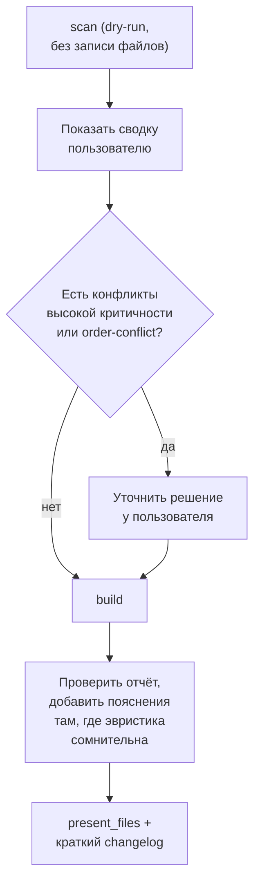

# Техническое задание: скил `assets-builder`

**Пакет для LLM (формат Anthropic Agent Skills), оркеструющий сборку CSS/JS через `assets-builder.py`**

> Версия документа: 1.0 · Дата: 2026-08-18
> Статус: аналитика и требования готовы, файлы скила не созданы
> Смежный документ: `TZ-assets-builder-script.md` — этот скил не дублирует логику парсинга/графа/кеша, а **вызывает** готовый скрипт как инструмент и добавляет слой суждения там, где детерминированный анализ принципиально не может решить однозначно (см. §5).
>
> Формат ниже проверен по реальному примеру скила в этом окружении (`skill-creator`), а не собран по памяти — структура и требования к `SKILL.md` соответствуют фактическому загрузчику скилов.

---

## Важная поправка к исходной формулировке

В постановке задачи фигурировало имя `assets-builder.md` как главный файл скила. По факту загрузчик скилов ищет файл строго с именем **`SKILL.md`** (заглавными, без вариаций) внутри папки скила — это подтверждено и текстом `skill-creator` («Anatomy of a Skill»: `SKILL.md (required)`), и его же скриптом упаковки, который явно проверяет `skill_path / "SKILL.md"` перед сборкой архива. Поэтому:

- имя `assets-builder` — это имя **папки** скила и значение поля `name` во frontmatter;
- физический файл внутри неё называется `SKILL.md`;
- «архив скила» — это `.skill`-файл (обычный zip), который получается упаковкой папки скила скриптом `package_skill.py` (уже есть в этом окружении, писать свой упаковщик не нужно) — он и отвечает на вопрос «как упаковать» из исходной постановки.

## 1. Назначение и принцип

Скил учит LLM (Claude, в первую очередь в Claude Code / агентных окружениях с доступом к bash) распознавать задачу «собрать CSS/JS шаблона перед продажей», запускать `assets-builder.py` вместо повторения его логики токен за токеном, интерпретировать отчёт и кеш, и добавлять суждение там, где скрипт сознательно не принимает решение сам (высококритичные конфликты, противоречивый порядок подключения, пограничные случаи классификации).

**Ключевой принцип**: скил не должен парсить HTML/CSS/JS и строить граф зависимостей рассуждениями модели — это ровно тот класс механической, потенциально объёмной работы (десятки-сотни файлов), которая должна выполняться кодом, а не LLM. Ценность скила — в оркестрации, суждении и коммуникации с пользователем, а не в переизобретении того, что скрипт уже делает надёжно и дёшево.

## 2. Условия триггера

Черновик поля `description` (по конвенции этого окружения описание пишется по-английски и должно быть «настойчивым» — явно перечислять контексты срабатывания, а не только формальное назначение):

> Merge and richly document a front-end project's scattered CSS and JS files (nested in many folders, some shared, some page-specific) into single well-commented dist files (style.css / scripts.js) before selling a template. Builds a cross-page dependency graph, runs recursive impact ("domino") analysis, flags cross-file naming conflicts, and optionally verifies real class/function usage via a cached JSON map. Use this skill whenever the user wants to merge, bundle, consolidate, or "collect" CSS/JS from a multi-page HTML project into one file each; wants to prepare a template for marketplace sale (ThemeForest, TemplateMonster, Envato, CodeCanyon, etc.); asks which CSS classes or JS functions are actually used somewhere; or describes a nested folder structure and asks how to combine it into one file — even without using the word "bundle" or naming this skill directly.

Дополнительно стоит зашить в текст описания несколько буквальных русскоязычных формулировок триггера (`собрать/смержить/объединить css в один файл`, `подготовить шаблон к продаже`) — потому что реальные запросы пользователя, скорее всего, будут на русском, и явные фразы-триггеры повышают надёжность срабатывания сильнее, чем расчёт на кросс-языковое обобщение.

## 3. Структура пакета скила

```
assets-builder/
├── SKILL.md
├── scripts/
│   └── assets-builder.py          # движок из TZ-assets-builder-script.md, без изменений логики
└── references/
    ├── cache-schema.md            # копия схемы из §6 ТЗ на скрипт — как читать кеш/отчёт
    ├── comment-templates.md       # шаблоны заголовков-комментариев из §7 ТЗ на скрипт
    ├── conflict-playbook.md       # правила принятия решений по конфликтам (см. §6 ниже)
    ├── cli-reference.md           # таблица флагов из §8 ТЗ на скрипт
    └── sample-build-report.md     # разобранный пример отчёта — эталон для итогового summary
```

Папка `assets/` (для файлов, которые буквально попадают в результат — шаблоны, иконки, шрифты) сознательно не создаётся: скил ничего подобного в вывод не вкладывает, все выходные файлы генерирует сам скрипт.

Обоснование именно такого набора `references/*`: по правилу progressive disclosure (`SKILL.md` держится в пределах ~500 строк, детали выносятся в файлы, читаемые по требованию) в основной файл идёт только рабочий процесс и критерии «когда спрашивать пользователя», а справочные детали (точная схема JSON, точный CLI, плейбук по конфликтам) читаются моделью только тогда, когда реально нужны — иначе контекст засоряется деталями, которые нужны не при каждом запуске.

## 4. Требования к содержимому `SKILL.md`

**Frontmatter (обязательные поля):**
```yaml
---
name: assets-builder
description: <текст из §2>
---
```

**Обязательные разделы тела файла:**
1. Краткое описание задачи и принципа «скрипт делает механику, модель — суждение» (см. §1).
2. Пошаговый рабочий процесс (см. §5) с конкретными примерами вызова `scripts/assets-builder.py` через bash.
3. Как читать отчёт/кеш — краткая версия, с явной отсылкой «подробная схема — `references/cache-schema.md`».
4. Правила, когда обязательно спрашивать пользователя, а когда можно продолжать самостоятельно (см. §6) — это самая важная часть файла, она должна остаться в основном теле, а не уйти в references, так как это правило применяется на каждом запуске.
5. Требуемый формат финального ответа пользователю (см. §5, шаг WF-6).

Всё остальное (полная схема кеша, полный список CLI-флагов, детальный плейбук конфликтов по типам) — в `references/*`, не в `SKILL.md`.

## 5. Рабочий процесс LLM



**WF-1.** Определить корень проекта (из контекста/загруженных файлов) и режим (`basic`/`extended`). Если неочевидно — по умолчанию начинать с `scan` в режиме `basic`: это безопасная операция без побочных эффектов, не требующая подтверждения.

**WF-2.** Выполнить `python scripts/assets-builder.py scan --project <path> ...` через bash-инструмент, прочитать `build-report.json`.

**WF-3.** Показать пользователю краткую сводку: сколько файлов, ключевые конфликты, кандидаты в неиспользуемые. **Обязательное условие остановки**: если есть конфликт критичности `high` (переопределение JS-имени или CSS-свойства) или зафиксирован order-conflict (см. FR-11 из ТЗ на скрипт) — модель должна спросить пользователя, как поступить, и не запускать `build` молча. Это единственная точка, где скил обязан требовать участия человека, независимо от того, что скрипт по умолчанию сам не блокируется (`--on-conflict warn`) — скил добавляет более строгий человеческий гейт поверх более мягкого дефолта скрипта.

**WF-4.** После подтверждения (или сразу, если блокирующих конфликтов нет) — выполнить `build` (с `--mode extended`, если запрошена проверка реального использования).

**WF-5.** Просмотреть `build-report.md`: если модель видит, что эвристика скрипта, вероятно, ошиблась (например, файл явно является базовым/reset-файлом, но попал в `page-specific`, потому что в тестовом дереве подключён только на одной странице) — добавить об этом поясняющую заметку в итоговый ответ. Это ровно то место, где суждение модели добавляет ценность поверх детерминированного инструмента.

**WF-6.** Показать пользователю финальные файлы (`style.css`, `scripts.js`, отчёт) через `present_files`, и коротким текстом — не пересказом всего отчёта, а: (а) что было объединено, (б) какие конфликты встретились и как решены, (в) явный список внешних/CDN-ресурсов, которые нужно оставить в HTML вручную (без этого сборка не будет работать «из коробки»).

## 6. Правила взаимодействия с пользователем (conflict-playbook, кратко)

Полная версия — в `references/conflict-playbook.md`; здесь — обязательные инварианты, которые должны быть и в `SKILL.md`, и в файле-плейбуке:

- Никогда не удалять код молча. `--strip-unused` — только по явной просьбе пользователя в текущем диалоге, никогда по умолчанию.
- Никогда не выбирать порядок JS при order-conflict без подтверждения пользователя (см. WF-3).
- Кандидаты `dynamic-suspect` (см. ТЗ на скрипт, FR-8) никогда не предлагать к удалению, даже если пользователь в целом согласился на `--strip-unused` — только `unused`.
- Конфликты низкой критичности не требуют остановки — упоминаются в финальной сводке одной строкой, не блокируют процесс.

## 7. Требования к `references/*`

- **`cache-schema.md`** — тот же JSON-пример, что в ТЗ на скрипт (§6), плюс краткое «как читать»: что означает каждый статус (`used`/`dynamic-suspect`/`unused`), как искать конкретный конфликт.
- **`comment-templates.md`** — шаблоны заголовков из ТЗ на скрипт (§7) как готовый образец, чтобы при написании итогового summary модель ссылалась на реальный формат, а не придумывала свой.
- **`conflict-playbook.md`** — правила из §6 в развёрнутом виде, по типам конфликтов, в формате «если severity = X и type = Y → действие Z».
- **`cli-reference.md`** — таблица флагов из ТЗ на скрипт (§8), чтобы не держать её в основном `SKILL.md`.
- **`sample-build-report.md`** — один полностью разобранный пример отчёта (вымышленный проект) с примером итогового ответа пользователю — чтобы снизить разброс в том, как модель формулирует сводку.

## 8. Нефункциональные требования

- Если зависимости скрипта (`beautifulsoup4`, `tinycss2`) не установлены в окружении — скил должен инструктировать модель установить их (`pip install beautifulsoup4 tinycss2 --break-system-packages`) как первый шаг, а не переходить к ручному регекс-парсингу силами модели.
- Скил должен оставаться переносимым между разными продуктами (Claude Code, Claude.ai computer use, Cowork) — не закладывать зависимость от инструментов сверх того, что уже используется в этом ТЗ (bash, чтение файлов, `present_files`, если доступен).
- `assets-builder.py` внутри `scripts/` — это тот же файл, что специфицирован в `TZ-assets-builder-script.md`, без форка логики; при обновлении скрипта обновляется один источник истины.

## 9. Критерии приёмки

- [ ] На запрос вида «собери мне все стили и скрипты для продажи шаблона» скил корректно триггерится и начинает с `scan`, а не сразу с `build`.
- [ ] При наличии в тестовом проекте намеренного high-severity JS-конфликта модель останавливается и спрашивает пользователя, не завершая сборку молча.
- [ ] Итоговое сообщение пользователю явно перечисляет внешние/CDN-ресурсы, не вошедшие в сборку.
- [ ] `SKILL.md` укладывается в ориентир ~500 строк; детали, не нужные при каждом запуске, вынесены в `references/*`.
- [ ] Упаковка через существующий `package_skill.py` проходит валидацию (`quick_validate.py`) без ошибок.

## 10. Открытые вопросы

Ниже — вопросы, которых не было в исходной постановке задачи, но которые существенно влияют на то, насколько результат применим «из коробки»:

1. **Переписывание HTML.** Сборка сама по себе не делает шаблон готовым к продаже: исходные HTML-страницы по-прежнему ссылаются на десятки старых файлов. Нужно ли скилу (или отдельным флагом скрипта) также предлагать обновить `<link>`/`<script>` теги в HTML-страницах, чтобы они указывали на новые `style.css`/`scripts.js`? Это не было явно запрошено, но без этого шага результат нельзя напрямую использовать — стоит явно решить, входит ли это в scope v1 или это следующая задача.
2. Нужен ли режим «жёсткого» отказа сборки при high-severity конфликтах по умолчанию (fail-closed), а не только через явный вопрос пользователю в скиле — например, для случаев, когда скил используется без интерактивного пользователя (полностью автономный пайплайн)?
3. Как поступать с лицензионными шапками вендорных файлов при их включении в общую сборку — сохранять как есть в начале секции (предлагается по умолчанию) или требовать отдельного подтверждения на каждый вендорный файл?
4. Основной язык тела `SKILL.md` и `references/*` — русский (под конкретного пользователя) или английский (единообразно с остальными скилами в этой среде, проще делиться/поддерживать)? Само поле `description`, по конвенции, в любом случае стоит оставить английским.
