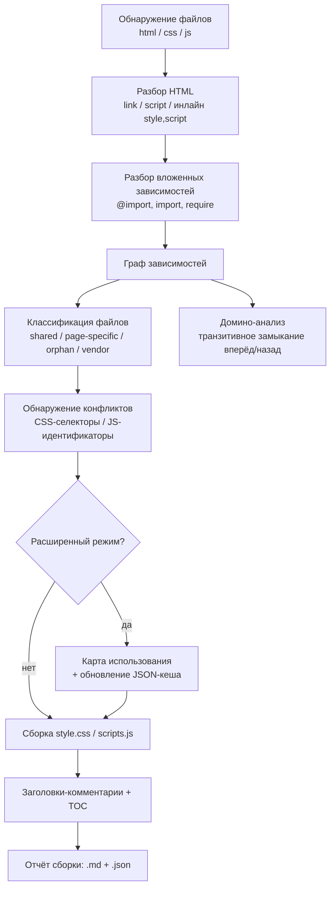
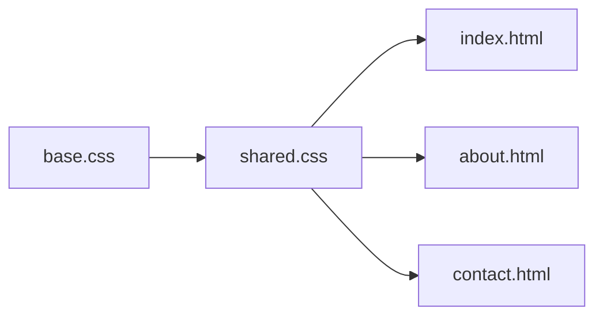
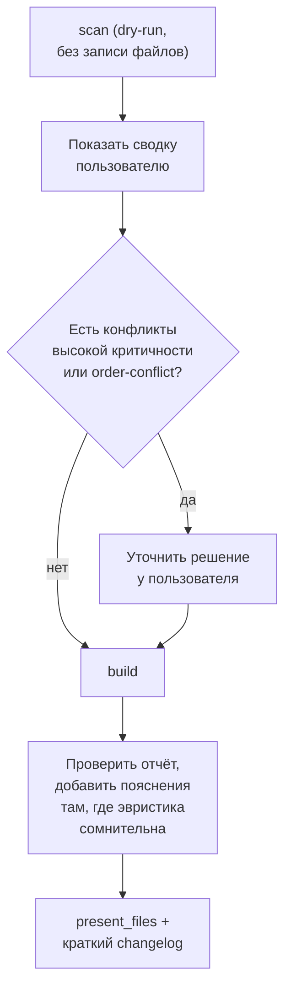

# assets-builder — Self-Contained Reference

> Один markdown-файл со всем содержимым: обзор, обе спецификации (ТЗ), оба отчёта о приёмке
> и полный исходный код — самого скрипта и всего пакета Claude-скила (`SKILL.md` + `references/*.md`).
> Ничего не вынесено в другие файлы: чтобы восстановить рабочий набор файлов, возьмите
> соответствующий блок кода ниже и сохраните его по указанному в заголовке пути — раздел
> "Как восстановить файлы" в конце делает это одной командой.
>
> Собрано 2026-09-16 из провалидированного набора `assets-builder-complete.zip` (23 файла) —
> код и тексты ниже полностью совпадают с тем архивом, а не пересказаны заново.

## Содержание

- [Обзор: два способа](#обзор-два-способа)
- [1. Скрипт — `assets-builder.py`](#1-скрипт--assets-builderpy)
  - [1.1 Спецификация (ТЗ)](#11-спецификация-тз)
  - [1.2 Отчёт о приёмке](#12-отчёт-о-приёмке)
  - [1.3 Исходный код](#13-исходный-код)
- [2. Claude-скил — `assets-builder`](#2-claude-скил--assets-builder)
  - [2.1 Спецификация (ТЗ)](#21-спецификация-тз)
  - [2.2 Отчёт о приёмке](#22-отчёт-о-приёмке)
  - [2.3 `SKILL.md`](#23-skillmd)
  - [2.4 `references/cli-reference.md`](#24-referencescli-referencemd)
  - [2.5 `references/cache-schema.md`](#25-referencescache-schemamd)
  - [2.6 `references/comment-templates.md`](#26-referencescomment-templatesmd)
  - [2.7 `references/conflict-playbook.md`](#27-referencesconflict-playbookmd)
  - [2.8 `references/sample-build-report.md`](#28-referencessample-build-reportmd)
- [Как восстановить файлы из этого документа](#как-восстановить-файлы-из-этого-документа)

---

## Обзор: два способа

Задача одна: собрать разбросанные по папкам CSS/JS файлы front-end проекта в два документированных файла (`style.css`, `scripts.js`) с разбором зависимостей, домино-анализом и обнаружением конфликтов. Решена она двумя интерфейсами к одному и тому же коду:

| | Способ 1 — скрипт напрямую | Способ 2 — Claude-скил |
|---|---|---|
| Кто запускает | Вы сами, из терминала (`assets-builder.py`, раздел 1) | Claude, по словесной просьбе (пакет из раздела 2) |
| Что нужно знать | Флаги CLI, либо меню `startgui` (то же самое, цифрами) | Ничего, кроме что вы хотите |
| При конфликте `severity: high` | Флаг `--on-conflict warn/fail` решает заранее | Claude останавливается и спрашивает именно про этот конфликт |
| Где хорошо | CI/CD, регулярная пересборка, полный контроль | Разовая подготовка шаблона, не хочется разбирать флаги |

Код скрипта (раздел 1.3) и код внутри скила (раздел 2.3, `scripts/assets-builder.py`) — **один и тот же файл** (сверено `diff`'ом перед сборкой этого документа), поэтому здесь он встроен только один раз — см. раздел 1.3; раздел 2 указывает на него, не дублируя.

---

## 1. Скрипт — `assets-builder.py`

### 1.1 Спецификация (ТЗ)

**Сборка и документированное объединение CSS/JS файлов front-end шаблона в два дистрибутивных файла**

> Версия документа: 1.1 · Дата: 2026-08-18 (дополнено 2026-08-20: startgui/help)
> Статус: реализовано и провалидировано целиком — см. `ACCEPTANCE-REPORT-script.md`
> Смежный документ: `TZ-assets-builder-skill.md` — этот скрипт проектируется как самостоятельный CLI-инструмент, который **также** вызывается изнутри LLM-скила `assets-builder` (см. смежный документ) вместо того, чтобы логика парсинга/графа зависимостей воспроизводилась в рассуждениях модели. Скрипт обязан полноценно работать и без скила.

---

#### Кратко (TL;DR)

- На входе — корень front-end проекта с HTML-страницами и деревом CSS/JS в произвольно вложенных папках.
- На выходе — один `style.css`, один `scripts.js`, каждый с секциями, размеченными комментариями (путь исходника, для каких страниц, общий/специфичный, конфликты), плюс JSON-отчёт и Markdown-отчёт сборки.
- Скрипт строит граф зависимостей (HTML → CSS/JS → вложенные `@import`/`import`), делает **домино-анализ** (рекурсивный обратный обход графа — «что сломается, если поменять файл X»), находит конфликты имён/селекторов, и в расширенном режиме проверяет реальное использование классов/функций через кешируемую JSON-карту.
- Ничего не удаляется молча: любые «неиспользуемые» находки только помечаются комментарием, если явно не запрошено иное.

---

#### 1. Контекст и цель

Исходная проблема: в проекте шаблона CSS/JS файлы разложены по вложенным папкам — часть общие, часть только для конкретной страницы. Для продажи шаблона нужен один файл стилей и один файл скриптов. Наивная конкатенация не подходит: теряется информация о происхождении кода, о том, для каких страниц он нужен, и не видно конфликтов между файлами.

Цель скрипта — детерминированно (без LLM в процессе выполнения) построить такую сборку: с трассируемостью происхождения каждого блока кода, с документированием через комментарии, с выявлением зависимостей и конфликтов, и с опциональной проверкой реального использования.

#### 2. Термины и определения

| Термин | Определение |
|---|---|
| Точка входа | HTML-файл, из которого начинается анализ подключений (`<link>`, `<script>`) |
| Общий (shared) файл | CSS/JS файл, подключённый на 2+ страницах |
| Специфичный (page-specific) файл | CSS/JS файл, подключённый ровно на 1 странице |
| Орфан (orphan) | CSS/JS файл, не подключённый ни на одной обнаруженной странице |
| Вендорный (vendor) файл | Файл сторонней библиотеки (по паттерну пути/имени или явному списку) |
| Граф зависимостей | Направленный граф: HTML → ассет, ассет → вложенный ассет (`@import`, `import`, `require`) |
| **Домино-анализ** | Рекурсивное вычисление транзитивного замыкания графа зависимостей в обе стороны: «вперёд» (что использует страница целиком, включая вложенные зависимости) и «назад» (какие страницы затронет изменение конкретного файла, с учётом цепочек вложенности) |
| Расширенный режим | Режим, в котором дополнительно проверяется фактическое использование каждого CSS-класса/ID и каждой JS-функции/переменной верхнего уровня по всему проекту |
| Карта использования / кеш | JSON-файл, ключи — имена классов/функций, значения — места определения и использования; переиспользуется между запусками по хешу файла |
| Конфликт | Совпадение имени (CSS-селектор или JS-идентификатор верхнего уровня) в двух и более файлах — с разной степенью критичности (см. §5.7) |

#### 3. Границы применения

**В скоупе v1:**
- Классические многостраничные HTML/CSS/JS проекты (без сборщика — `<link>`/`<script>` теги напрямую в HTML)
- Вложенные CSS `@import`
- Обнаружение ES-модульного/CommonJS синтаксиса (`import`/`require`) — с флагом как «требует ручной проверки», а не безопасной автоконкатенацией
- Инлайновые `<style>`/`<script>` блоки в HTML

**Вне скоупа v1** (зафиксировать как явные ограничения, не как забытые кейсы):
- Препроцессоры SCSS/LESS/Stylus (кандидат на v2)
- Проекты со сборщиком (Webpack/Vite/Rollup output, React/Vue SFC) — это принципиально другой тип входа
- CSS-in-JS, styled-components и подобные паттерны
- Полный семантический AST-анализ JS (see §10, ограничения)

#### 4. Пайплайн обработки (обзор)



#### 5. Функциональные требования

##### 5.1 FR-1 — Обнаружение файлов
Скрипт должен рекурсивно проиндексировать все `.html`, `.css`, `.js` под корнем проекта, кроме путей, попадающих под `--exclude`. Для каждого файла зафиксировать: абсолютный и относительный (от корня проекта) путь, размер, хеш содержимого (sha256, достаточно первых 16 hex-символов), время изменения.

##### 5.2 FR-2 — Разбор HTML
Для каждой точки входа извлечь в порядке следования по документу:
- `<link rel="stylesheet" href="...">`
- инлайновые `<style>...</style>` блоки (с позицией в файле)
- `<script src="...">` — с сохранением атрибутов `defer`/`async`/`type="module"`, так как они влияют на порядок исполнения
- инлайновые `<script>...</script>` блоки

Пути `href`/`src` разрешаются относительно расположения HTML-файла. Ссылки классифицируются как **локальные** (резолвятся внутри проекта) или **внешние** (`http://`, `https://`, `//cdn...`) — внешние в сборку не включаются, но фиксируются в отчёте как «должны остаться отдельными тегами в финальном HTML».

##### 5.3 FR-3 — Вложенные зависимости
- CSS: `@import url(...)` / `@import "..."`, включая форму с медиа-условием (`@import "x.css" screen and (max-width: 600px)`) — при инлайнинге такого импорта его содержимое должно быть обёрнуто в `@media (...) { ... }`, иначе теряется исходная семантика.
- JS: обнаружение `import ... from '...'`, `export ... from '...'`, `require('...')` — это **не** конкатенируется автоматически как обычный скрипт, а помечается как «модульная зависимость, требует ручной проверки перед сборкой», поскольку наивное склеивание ESM/CJS кода семантически некорректно.

##### 5.4 FR-4 — Граф зависимостей
Построить направленный граф: узлы — HTML и CSS/JS файлы, рёбра — отношение «подключает»/«импортирует». Обязательна поддержка обхода в обе стороны (см. FR-6). Циклы (A импортирует B импортирует A) должны обнаруживаться и не приводить к бесконечной рекурсии (предел глубины + set посещённых узлов); цикл фиксируется как отдельная запись в отчёте.

##### 5.5 FR-5 — Классификация файлов
Каждый CSS/JS файл получает одну из меток: `shared` (2+ страницы, с их списком), `page-specific` (ровно 1 страница, с её именем), `orphan` (0 страниц), `vendor` (путь/имя совпадает с `--vendor` паттерном, либо эвристика: папка `vendor/`, `lib/`, `libs/`, `plugins/`, `node_modules/`, либо суффикс `*.min.css`/`*.min.js`).

##### 5.6 FR-6 — Домино-анализ
Формальное определение (см. термин в §2):
- **Вперёд**: для страницы — полный список всех CSS/JS, используемых прямо или через цепочку вложенных зависимостей.
- **Назад**: для любого CSS/JS файла — полный список страниц, которые затронет его изменение, с учётом всех промежуточных звеньев цепочки.

Пример: `base.css` подключён через `@import` в `shared.css`, а `shared.css` подключён на трёх страницах — изменение `base.css` «падает домино» через `shared.css` и затрагивает все три:



Это должно быть доступно не только в общем отчёте, но и через отдельную подкоманду `impact <file>` (см. §8), которая печатает список затронутых страниц для конкретного файла — полезно при точечных правках уже собранного шаблона.

##### 5.7 FR-7 — Обнаружение конфликтов

**CSS.** Парсинг через нормальный CSS-парсер (не регулярки — см. §11) в тройки (селектор, блок объявлений, файл+строка). Один и тот же селектор в 2+ файлах → кандидат в конфликт. Критичность вычисляется сравнением на уровне свойств:

| Критичность | Условие | Пример |
|---|---|---|
| Низкая (информационно) | Идентичный селектор и идентичные объявления | Скопированный reset в двух файлах |
| Средняя | Идентичный селектор, разные *свойства* (не пересекаются) | `.card{padding}` в одном файле, `.card{border-radius}` в другом — каскад просто сложит оба |
| Высокая | Идентичный селектор, одно и то же *свойство*, разное *значение* | `.card{padding:10px}` vs `.card{padding:20px}` — реальный риск переопределения, зависит от итогового порядка |

**JS.** Парсинг верхнеуровневых объявлений: `function name(...)`, `const/let/var name = ...` в глобальной области, `window.name = ...`. Совпадение имени в 2+ файлах:

| Критичность | Условие |
|---|---|
| Низкая | Идентичное имя и идентичное тело (по хешу) — чистый дубль |
| Высокая | Идентичное имя, разное тело — при конкатенации побеждает последнее определение молча, это баг, а не стилистическая неоднозначность |

Для JS нет «средней» критичности — совпадение имени в глобальной области либо безвредный дубль, либо реальный риск затирания.

##### 5.8 FR-8 — Расширенный режим: карта использования
- Из каждого CSS-файла извлекаются все объявленные классы/ID; из каждого JS-файла — все верхнеуровневые имена (см. FR-7).
- «Использование» ищется: в HTML — по токенам атрибутов `class="..."`/`id="..."`; в JS — по вхождениям идентификатора вне строки его собственного объявления; дополнительно эвристически — вхождения имени класса внутри строковых литералов JS (`classList.add('x')`, `className = 'x'`, шаблонные строки).
- Каждому имени присваивается статус: `used` (найдено ≥1 использование), `dynamic-suspect` (упоминается только в конструируемых строках — не может быть подтверждено статически: конкатенация, тернарники, вычисляемые свойства), `unused` (использований не найдено нигде).
- **Важное ограничение, которое нужно явно проговорить в реализации**: полное разрешение динамически конструируемых имён классов/функций (например, через конкатенацию строк или `window['fn']()`) статическим анализом принципиально не решается на 100% — поэтому `unused` в выводе — это *подсказка для ревью*, а не гарантированно мёртвый код.
- По умолчанию `unused`-элементы **остаются** в сборке, но помечаются комментарием-предупреждением рядом с определением. Удаление — только по явному флагу `--strip-unused`, и даже тогда — никогда для элементов со статусом `dynamic-suspect`.

##### 5.9 FR-9 — Кеш и его инвалидация
- Файл кеша (по умолчанию `.assets-builder-cache.json`, схема — §6) сохраняется между запусками.
- При повторном запуске пересчитываются (парсятся заново) только файлы, чей хеш изменился или которые появились впервые; записи для удалённых файлов вычищаются.
- В кеше — поле версии схемы; при несовпадении версии кеш просто пересобирается с нуля с предупреждением, а не приводит к падению скрипта.

##### 5.10 FR-10 — Сборка `style.css`
- Порядок: (а) топологическая сортировка с учётом цепочек `@import`; (б) внутри неё — укрупнённые секции в порядке *Vendor* (если не исключены) → *Общие* → *По страницам* (постранично, страницы в порядке первого обнаружения); (в) внутри одного уровня — исходный порядок `<link>` как tie-break.
- Исходное содержимое файла **не переформатируется и не минифицируется** — сохраняется байт-в-байт, комментарии только оборачивают блок снаружи. Это принципиально: цель — документирование, а не рефакторинг чужого кода.
- В начале файла — автосгенерированное оглавление (комментарий-блок) со списком всех включённых файлов и их областью действия — для быстрой навигации по большому сборному файлу.

##### 5.11 FR-11 — Сборка `scripts.js`
Аналогично FR-10, но с дополнительным требованием к порядку: JS гораздо менее терпим к перестановке, чем CSS. Базовый принцип — сохранять исходный относительный порядок `<script>`-тегов на странице, дополненный топологической сортировкой по обнаруженным зависимостям (FR-3).

**Особый случай — противоречивый порядок.** Если страница A подключает файлы в порядке `[X, Y]`, а страница B — в порядке `[Y, X]`, это неразрешимо автоматически корректно для обеих одновременно. Поведение по умолчанию (`--on-order-conflict warn`): собрать с детерминированным best-effort порядком (топологическая сортировка + алфавитный tie-break) и вставить явный предупреждающий баннер-комментарий перед обоими блоками с указанием обеих страниц и их порядков; при `--on-order-conflict fail` — прервать сборку JS. Скрипт не должен решать это молча.

Оборачивание каждого блока в IIFE для изоляции — **не делать по умолчанию** (флаг `--wrap-iife`, выключен): если исходный код рассчитывает на общую глобальную область (например, `utils.js` объявляет функцию, которую вызывает `page.js`), обёртка сломает работу шаблона.

##### 5.12 FR-12 — Отчёт сборки
Markdown (человекочитаемый) + JSON (машиночитаемый), одинаковое содержание:
- количество обработанных файлов по типам;
- карта страница → ассеты;
- разбивка по классификации (shared/page-specific/orphan/vendor);
- все конфликты, сгруппированные по критичности;
- (расширенный режим) список `unused`/`dynamic-suspect`;
- домино-подсветка (например: «наиболее широко связанный общий файл: X, влияет на N из M страниц»);
- размер до/после;
- список внешних (не смерженных) ассетов, которые должны остаться в HTML вручную.

##### 5.13 FR-13 — CLI и подкоманды
- `scan` — только анализ и отчёт, без записи выходных CSS/JS (безопасный dry-run)
- `build` — полный пайплайн с записью выходных файлов
- `impact <path>` — точечный запрос домино-анализа для одного файла
- `clean-cache` — сброс кеша

#### 6. Формат кеш-файла

```json
{
  "cacheVersion": 1,
  "generatedAt": "2026-08-18T12:00:00Z",
  "projectRoot": "/path/to/project",
  "files": {
    "assets/css/main.css": {
      "hash": "a1b2c3d4e5f60718",
      "size": 4213,
      "mtime": "2026-08-10T09:12:00Z",
      "type": "css",
      "classification": "shared",
      "usedByPages": ["index.html", "about.html"],
      "dependsOn": ["assets/css/vendor/reset.css"]
    }
  },
  "cssSelectors": {
    ".card": {
      "definedIn": [{"file": "assets/css/components/cards.css", "line": 12}],
      "usedIn": [{"file": "index.html", "line": 34, "context": "html-class"}],
      "status": "used"
    }
  },
  "jsSymbols": {
    "initSlider": {
      "definedIn": [{"file": "assets/js/modules/slider.js", "line": 3}],
      "usedIn": [{"file": "assets/js/main.js", "line": 21, "context": "call"}],
      "status": "used"
    }
  },
  "conflicts": [
    {
      "type": "css-selector-override",
      "selector": ".card",
      "files": ["assets/css/components/cards.css", "assets/css/pages/shop.css"],
      "severity": "high",
      "detail": "padding: 10px vs padding: 20px"
    }
  ]
}
```

#### 7. Формат комментариев в результирующих файлах

Пример заголовка секции для CSS (шаблон для JS аналогичен, с адаптацией под `//` или `/* */`):

```css
/* ============================================================
   FILE: assets/css/pages/shop.css
   SCOPE: page-specific
   USED ON: shop.html, shop-grid.html
   SIZE: 4.2 KB | 182 lines
   DEPENDS ON: assets/css/components/buttons.css (@import)
   CONFLICTS: .card — see also assets/css/components/cards.css (severity: high)
   ============================================================ */
```

Обязательные поля: исходный относительный путь, область (shared/page-specific + страницы), размер, зависимости (если есть), конфликты (если есть). В начале файла — блок-оглавление со списком всех секций.

**Язык подписей комментариев должен быть настраиваемым** (`--comment-lang ru|en`, по умолчанию `en`) — итоговый шаблон обычно продаётся на международных площадках (ThemeForest и т.п.), поэтому английские комментарии — более безопасный дефолт, даже если разработка велась на русском.

#### 8. CLI — таблица флагов

| Флаг | Значение по умолчанию | Описание |
|---|---|---|
| `--project <path>` | — (обязателен) | Корень проекта |
| `--entry <glob>` | `**/*.html` | Какие HTML считать точками входа |
| `--out-css <path>` | `dist/style.css` | Путь выходного CSS |
| `--out-js <path>` | `dist/scripts.js` | Путь выходного JS |
| `--mode` | `basic` | `basic` \| `extended` |
| `--cache <path>` | `.assets-builder-cache.json` | Путь кеша |
| `--no-cache` | выкл. | Игнорировать кеш, полный пересчёт |
| `--exclude <globs>` | — | Паттерны исключения (через запятую) |
| `--vendor <globs>` | — | Явные паттерны вендорных файлов |
| `--on-conflict` | `warn` | `warn` \| `fail` |
| `--on-order-conflict` | `warn` | `warn` \| `fail` (см. FR-11) |
| `--strip-unused` | выкл. | Только `extended`; никогда не трогает `dynamic-suspect` |
| `--comment-lang` | `en` | `ru` \| `en` |
| `--js-parser` | `heuristic` | `heuristic` \| `ast` (см. §11) |
| `--report <path>` | `dist/build-report.md` | Markdown-отчёт |
| `--report-json <path>` | `dist/build-report.json` | JSON-отчёт |
| `--quiet` / `--verbose` | — | Уровень логирования |

Подкоманды: `scan`, `build`, `impact <file>`, `clean-cache` (см. FR-13).

#### 9. Нефункциональные требования

- Только чтение исходного дерева проекта; запись — исключительно в выходную директорию и файл кеша.
- Идемпотентность: неизменённый вход → побайтово идентичный выход (детерминированная сортировка) — важно для диффов в системе контроля версий.
- Не требует сетевого доступа — чистый локальный статический анализ.
- Явная, не приводящая к падению обработка не-UTF-8 файлов (пропуск с предупреждением).
- Целевая производительность (ориентир, не жёсткая гарантия): холодный прогон на ~1000 файлов — единицы минут; повторный прогон с валидным кешем — единицы секунд.
- Python 3.10+.

#### 10. Известные ограничения (проговорить явно, а не молчать о них)

- Динамическое конструирование имён классов/функций в JS не разрешается статически до конца (см. FR-8).
- Препроцессоры (SCSS/LESS), модульные сборщики (Webpack/Vite), CSS-in-JS — вне скоупа v1.
- Использование через `eval`/рефлексию (`window['name']()`) не обнаруживается.
- Уже минифицированные вендорные файлы не подвергаются посимвольному usage-анализу — трактуются как непрозрачный блок.

#### 11. Рекомендуемый стек и внутренняя организация

- **Один файл** `assets-builder.py` (в духе «просто скрипт для питона»), логически разбитый на секции/функции: discovery → html_parser → nested_deps → graph → classification → conflicts → usage_map → cache → merge_css → merge_js → report → cli. Если разрастётся сверх разумного — допустимо вынести в небольшой пакет, но по умолчанию — один файл.
- HTML: `beautifulsoup4` (устойчивее к «грязному» реальному HTML шаблонов, чем `html.parser` из stdlib).
- CSS: `tinycss2` (чистый Python, без C-зависимостей, толерантен к ошибкам).
- JS: по умолчанию (`--js-parser heuristic`) — регулярные выражения/эвристики для верхнеуровневых `function`/`const`/`let`/`var`/`window.x=` — этого достаточно для подавляющего большинства неминифицированного шаблонного JS. Опционально (`--js-parser ast`) — интеграция полноценного парсера (например, вызов Node+Acorn через subprocess, если Node доступен в окружении) для повышенной точности; скрипт обязан корректно работать и без Node, поскольку основной режим — регулярки.

#### 12. Критерии приёмки

- [ ] На тестовом дереве из 3+ страниц с общими и специфичными CSS/JS файлами скрипт корректно классифицирует каждый файл.
- [ ] Изменение одного вложенного файла (`@import`) при повторном запуске приводит к пересчёту только затронутых записей кеша (проверка инвалидации).
- [ ] Внесённый намеренно CSS-конфликт (одно свойство, разные значения) помечается критичностью `high` и отражается в комментарии рядом с обоими блоками.
- [ ] Внесённый намеренно JS-конфликт (одинаковое имя функции, разное тело) отражается в отчёте с критичностью `high`.
- [ ] В `extended` режиме класс, не используемый нигде, помечается `unused`, но остаётся в выходном файле без флага `--strip-unused`.
- [ ] Внешний (CDN) `<script src="https://...">` не включается в сборку и фигурирует в отчёте как «оставить вручную».
- [ ] Повторный запуск на неизменённом проекте даёт побайтово идентичный `style.css`/`scripts.js`.

#### 13. Допущения и открытые вопросы

Ниже — решения, принятые по умолчанию в этом ТЗ, которые стоит явно подтвердить или скорректировать перед реализацией:

1. Вендорные файлы по умолчанию **включаются** в сборку (с отдельной секцией и сохранением их license-шапки, если она есть), а не исключаются — но это конфигурируется через `--exclude`. Стоит подтвердить, нужен ли такой дефолт.
2. IIFE-обёртка выключена по умолчанию (см. FR-11) — сознательный выбор в пользу «не сломать», а не «максимально изолировать».
3. Требуется ли поддержка препроцессоров (SCSS/LESS) уже в v1, или это осознанно переносится в v2 — сейчас в ТЗ зафиксировано как «вне скоупа v1».
4. Максимальная глубина рекурсии для обхода графа (защита от патологических случаев) — предлагается 50, но не зафиксировано жёстко.

---

#### 14. Расширение: `startgui` и `help` (FR-14…FR-16)

**Добавлено 2026-08-20, дополняет разделы выше, не заменяет их.** Материалы: реальный `assets-builder.py` (1244 строки на момент анализа, провалидированный — см. `ACCEPTANCE-REPORT-script.md`).

##### 14.1 Системный анализ (обязательный шаг перед проектированием интерфейса)

**Факты о скрипте на момент анализа** (проверены запуском `--help`, не взяты из памяти): 4 подкоманды (`scan`, `build`, `impact`, `clean-cache`); 16 уникальных флагов, из них 8 общих для всех команд и 6 специфичны только для `build` (самая «тяжёлая» по числу решений); 1 позиционный аргумент (`file` у `impact`); справки по существу нет — только механический `-h`/`--help` от argparse без объяснения смысла, кодов возврата, `DEFAULT_EXCLUDE`.

Все 4 подкоманды уже инкапсулированы в `cmd_scan(args)`, `cmd_build(args)`, `cmd_impact(args)`, `cmd_clean_cache(args)` — каждая читает параметры через `args.<имя>` (атрибутный доступ), ни одна не требует именно `argparse.Namespace`. **Вывод, определяющий весь дизайн**: меню — не пятая независимая реализация логики, а альтернативный способ заполнить те же объекты `args`; `startgui` обязан вызывать существующие функции напрямую, собрав `SimpleNamespace` с теми же полями, без единой правки в них. `build` с 6 флагами — самый сложный под-поток (до 7 вопросов), `impact` — самый простой (1 вопрос); сложность под-потоков должна отражать эту асимметрию. Раз `help` должен объяснять в том числе `startgui` — его реализация логически идёт последней.

##### 14.2 Термины

`startgui` — несмотря на название, **не графический интерфейс**: ни окна, ни мыши, ни curses, только текстовое меню в stdout и ввод номера через stdin («как раньше — клацали цифры»). Под-поток (sub-flow) — последовательность вопросов после выбора действия. Сессионное состояние — значения (в первую очередь `--project`), которые меню помнит в рамках одного запуска.

##### 14.3 Дизайн-принципы

- **Переиспользование, не дублирование** — прямое следствие вывода из §14.1.
- **Только `input()`/`print()` из stdlib, без `curses`/`rich`/`questionary`** — три причины: соответствие постановке задачи; ноль новых зависимостей; **тестируемость** (`input()`-код прогоняется через `printf '1\n1\n\n' | ...`, `curses` требует настоящего TTY и не запустится в тех условиях, где сам скрипт уже тестируется).
- **ASCII, не Unicode box-drawing** — шаблон открывают на случайных машинах, включая Windows-консоли с нестандартной кодовой страницей.
- **Не падать ни на каком вводе** — нечисловой/вне-диапазона ввод переспрашивается, не роняет процесс; `Ctrl+C`/EOF перехватываются и завершают работу опрятно.
- **Не очищать экран между экранами меню** — пользователь может захотеть перечитать вывод предыдущего действия.
- **`--project` спрашивается один раз за сессию**, не на каждом пункте.

##### 14.4 Функциональные требования

**FR-14 — главное меню и цикл.** Показывает текущий проект (или «не выбран»), пронумерованное меню действий, валидирует ввод с повтором при ошибке, по завершении под-потока возвращает в меню (цикл до выбора выхода).

```
================================================================
  assets-builder — интерактивный режим
================================================================
  Текущий проект: /home/user/my-template

  1) Сканировать проект (scan)     — анализ без записи файлов
  2) Собрать проект (build)        — записать style.css/scripts.js
  3) Влияние файла (impact)        — что затронет изменение файла
  4) Очистить кеш (clean-cache)
  5) Справка (help)
  6) Сменить путь к проекту
  0) Выход
================================================================
```

**FR-15 — под-потоки.** `scan` — 2 вопроса (режим, сохранить ли отчёт). `build` — до 7 вопросов (режим, пути вывода, язык комментариев, поведение при конфликте, поведение при order-конфликте, `--strip-unused` — только если выбран `extended`). `impact` — 1 вопрос (путь файла, пустой ввод переспрашивается — нет осмысленного дефолта). `clean-cache` — 1 подтверждение (Y/n).

**FR-16 — команда `help` (реализуется последней).** Вызов: `assets-builder.py help [topic]`, дополняет, не заменяет `-h`/`--help`. Темы минимум: `overview`, `scan`, `build`, `impact`, `clean-cache`, `startgui`, `exit-codes`, `defaults` — содержание должно быть согласовано с `references/cli-reference.md` из пакета скила, без расхождений. Доступна и из `startgui` (пункт «5) Справка»), тем же рендерером.

##### 14.5 CLI-обвязка

`startgui [--project <path>]` — единственная команда, где `--project` **не** обязателен (иначе теряется смысл интерактивного запроса пути). `help [topic]` — `topic` позиционный, опциональный.

##### 14.6 Технические ограничения

**Запрещено** менять сигнатуры и внутреннюю логику `cmd_scan`/`cmd_build`/`cmd_impact`/`cmd_clean_cache` — только собирать `SimpleNamespace` с полным набором полей, которые производит `argparse`, и вызывать существующую функцию как есть. Новый вспомогательный код — новые функции в том же файле, не новый модуль.

##### 14.7 Нефункциональные требования

Без новых pip-зависимостей; работает при вводе через pipe, не только интерактивный TTY; не зависит от ширины терминала; каждый под-поток перехватывает исключения из вызываемой `cmd_*`, не роняя всю сессию.

##### 14.8 Известные ограничения (сознательно вне скоупа)

Нет навигации стрелками/мышью; нет работы с несколькими проектами одновременно кроме явной смены пути; `startgui` — блокирующий синхронный процесс, не для встраивания в автоматизацию (для этого — прямой CLI).

##### 14.9 Критерии приёмки

- [x] `help` без аргументов — список тем; `help build` — только тема `build`.
- [x] `startgui` без `--project` открывает меню и спрашивает путь при первом действии, требующем проекта.
- [x] Ввод вне диапазона и нечисловой ввод не крашат процесс — переспрашивается тот же вопрос.
- [x] **Побайтовая идентичность**: одна и та же комбинация параметров через `startgui` и напрямую флагами в `build` — идентичные `style.css`/`scripts.js`.
- [x] `Ctrl+C`/EOF завершает процесс сообщением, не трейсбеком.
- [x] Пустой Enter на вопросе с дефолтом использует дефолт.
- [x] Вопрос про `--strip-unused` не задаётся, если ранее выбран `basic`.
- [x] Содержимое `help defaults`/`help exit-codes` совпадает по фактам с `references/cli-reference.md`.

Все 8 пунктов подтверждены — подробности проверки в `ACCEPTANCE-REPORT-script.md` §7.

##### 14.10 Допущения

Дефолт для «При критичном конфликте» в под-потоке `build` — `warn`, как и в прямом CLI. `--quiet`/`--verbose` в под-потоках не спрашиваются вовсе, зафиксировано `quiet=False` всегда при вызовах из `startgui`.


### 1.2 Отчёт о приёмке

**Phase 4+5 планов сборки скрипта и расширения `startgui`/`help` (оба плана удалены после исполнения — это их итог)**

> Дата: 2026-08-19, дополнено 2026-08-20 и 2026-08-23. Все задачи по обоим планам реализованы и прогнаны против фикстуры. Ниже — что именно проверено, что найдено и исправлено по ходу, и что осталось как явный, осознанный гэп.

---

#### 1. Что сделано

Единый файл `assets-builder.py` (~1230 строк), команды `scan` / `build` / `impact <file>` / `clean-cache`. Все секции соответствуют категориям плана — см. заголовки-комментарии внутри файла (`DISCOVERY`, `HTML_PARSE`, `DEP_GRAPH`, `CONFLICT_CSS/JS`, `MERGE_CSS/JS`, `USAGE_MAP`, `CACHE`, `REPORT`, `CLI`).

Зависимости: `beautifulsoup4`, `tinycss2` (установлены и используются как в TZ §11, не regex-парсинг CSS/HTML).

#### 2. Тестовая фикстура

Собрана отдельно (`fixture/`) специально под критерии приёмки TZ §12: 3 страницы, общий/специфичный/orphan/vendor CSS и JS, вложенный `@import` (включая с медиа-условием `print`), намеренные конфликты трёх уровней критичности, внешний CDN-скрипт, неиспользуемые класс и функция. Отдано вместе со скриптом как живой пример (`fixture/dist/` — результат реальной сборки в extended-режиме).

#### 3. Найден и исправлен 1 значимый баг

**Самозагрязнение при повторном запуске.** По умолчанию `--out-css`/`--out-js` пишут в `dist/` внутри корня проекта. DISCOVERY на следующем запуске находил `dist/style.css`/`dist/scripts.js` от *предыдущей* сборки как обычные исходники — они снова попадали в анализ и в новую сборку, давая вложенные копии символов и ложные срабатывания «используется» (в т.ч. ложноотрицательный `unused` для `legacyHelper`, которая на самом деле нигде не вызывается).

Исправление: `DEFAULT_EXCLUDE = ["dist/**", ".git/**", "node_modules/**"]` — применяется всегда, независимо от `--exclude`; плюс `build` дополнительно исключает точные пути `--out-css`/`--out-js`, если они переопределены вне `dist/`. После фикса — перепроверено с нуля, все критерии ниже проходят на чистой фикстуре.

#### 4. Критерии приёмки — TZ §12 (все 7)

| № | Критерий | Статус | Как проверено |
|---|---|---|---|
| 1 | Классификация shared/page-specific/orphan/vendor корректна на 3+ страницах | ✅ | `scan`: shared 4, page-specific 2, orphan 1, vendor 2 — совпало с ожидаемым по фикстуре |
| 2 | Изменение вложенного файла инвалидирует только его запись в кеше | ✅ | touch `shop.css` → `{"reused": 11, "rescanned": 1}` |
| 3 | Намеренный CSS-конфликт (1 свойство, разные значения) → `high`, отражён в комментарии у обоих блоков | ✅ | `.card`: `padding 10px` vs `20px` → `high` в отчёте и в обеих шапках-комментариях |
| 4 | Намеренный JS-конфликт (одинаковое имя, разное тело) → `high` в отчёте | ✅ | `initApp` → `high`, "последнее определение молча победит" |
| 5 | `unused` в extended-режиме остаётся в выводе без `--strip-unused` | ✅ | Первый extended-прогон без флага: `.unused-badge` и др. в выводе, с предупреждающим комментарием |
| 6 | Внешний CDN `<script src="https://...">` не в сборке, в отчёте как "оставить вручную" | ✅ | 0 вхождений в `scripts.js`; есть строка в разделе "Внешние ресурсы" отчёта |
| 7 | Повторный запуск на неизменённом проекте → побайтово идентичный вывод | ✅ | `diff` двух независимых сборок с нуля — 0 расхождений |

Дополнительно проверено сверх обязательного списка §12: защита от `--strip-unused`, стирающего `dynamic-suspect` (класс, добавляемый через `classList.add()`, подтверждённо НЕ удаляется, в отличие от честно неиспользуемого); `--on-conflict fail` корректно прерывает сборку (exit 2); циклический `@import` (A↔B) не вызывает зависания/падения ни в `scan`, ни в `build`; реальный order-conflict между двумя страницами (файлы в противоположном порядке) — детектируется, попадает в баннер и отчёт, `--on-order-conflict fail` прерывает сборку (exit 3).

#### 5. Известные гэпы (сознательно не блокировали приёмку)

- **`--js-parser ast`** — флаг из TZ §8 не реализован; работает только `heuristic` (это и был режим по умолчанию в TZ, `ast` там же был помечен опциональным).
- **`--verbose`** — флаг принимается, но пока не даёт доп. детализации сверх обычного вывода.
- **Порядок JS при группировке.** MERGE_JS группирует `vendor → shared → page-specific` жёстко (см. TZ FR-10). Это может отличаться от исходного порядка `<script>` на конкретной странице, если на ней page-specific файл стоял ДО shared (в фикстуре так и есть на `shop.html`) — но при этом *настоящий* конфликт между двумя страницами (FR-11) по-прежнему ловится и баннерится корректно; не пойман только «молчаливый» пересмотр порядка внутри одной страницы. На практике это чаще безопасное направление (shared код объявляется раньше, а `function`-декларации в JS поднимаются хостингом), но это не то же самое, что буквальное «сохранить исходный порядок». Если это важно для реальных проектов — стоит отдельно доработать топологию, не разбивая на жёсткие группы.

#### 6. Что не входит в эту поставку

Обновление `<link>/<script>` в исходных HTML на новые `style.css`/`scripts.js` — этот вопрос был явно вынесен как открытый в `TZ-assets-builder-skill.md` §10, п.1, и не входил в план скрипта.

#### 7. `startgui` и `help` (2026-08-20): 11 из 11 задач

`assets-builder.py`: 1244 → 1638 строк. Добавлены подкоманды `startgui` (интерактивное текстовое меню) и `help [topic]`, без единой правки в `cmd_scan/cmd_build/cmd_impact/cmd_clean_cache` — оба нововведения только вызывают их (TZ §14.6).

**Найден и исправлен 1 баг.** При вставке большого блока (`PROMPT_HELPERS` + `startgui` + `help`, ~580 строк) перед `build_arg_parser()` потерялась сама строка `def build_arg_parser():` — тело функции осталось, а объявление исчезло; `help` падал с `NameError`. Обнаружено на первом же прогоне валидации (в этом и цель валидации — не поверить, что вставка прошла успешно, а проверить). Исправлено точечно, синтаксис и работоспособность перепроверены с нуля.

**Критерии приёмки — TZ §14.9 (все 8):**

| № | Критерий | Статус | Как проверено |
|---|---|---|---|
| 1 | `help` без аргументов — список тем; `help build` — только тема build | ✅ | Прогнано отдельно, содержимое корректно |
| 2 | `startgui` без `--project` открывает меню, спрашивает путь при первом действии | ✅ | Полный сценарий: запуск без `--project` → выбор scan → запрос пути → scan выполнен |
| 3 | Некорректный (`9`) и нечисловой (`abc`) ввод не крашат, переспрашивают | ✅ | Оба случая, процесс не упал, вопрос повторился |
| 4 | **Побайтовая идентичность**: build через CLI и через startgui с теми же параметрами | ✅ | `diff` — 0 расхождений по `style.css` и `scripts.js` |
| 5 | Ctrl+C/EOF завершает без трейсбека | ✅ | EOF посреди диалога → сообщение, код 0 |
| 6 | Пустой Enter использует дефолт; вопрос без дефолта (impact) переспрашивает пустой ввод | ✅ | Оба пути проверены отдельно |
| 7 | Вопрос про `--strip-unused` не задаётся в `basic`, задаётся в `extended` | ✅ | grep по логам сессии: 0 вхождений в basic, 1 в extended |
| 8 | Содержимое `help defaults`/`help exit-codes` совпадает по фактам с `references/cli-reference.md` | ✅ | Построчная сверка: коды возврата и статус `--js-parser` идентичны |

Дополнительно проверено: `clean-cache` и `help` (пункт 5) корректно работают из самого меню, не только с прямого CLI. `assets-builder.py` синхронизирован в `2-skill/assets-builder/scripts/` (`diff` подтверждает идентичность), `.skill`-архив пересобран, `quick_validate.py` пройден повторно.

Известные ограничения без изменений с этапа ТЗ (§14.8): нет навигации стрелками/мышью, нет параллельной работы с несколькими проектами, `startgui` не адаптируется под ширину терминала. `--quiet`/`--verbose` в под-потоках не спрашиваются — зафиксировано `quiet=False` всегда.

#### 8. Аддендум (2026-08-23): перевод интерфейса на английский

По запросу проверено и исправлено: до этого момента консольный вывод, всё меню `startgui`, содержимое `help` и часть `detail`-строк конфликтов были жёстко зашиты на русском — независимо от `--comment-lang`. Систематический аудит (`grep` по кириллице) нашёл 213 строк; переведены все, кроме намеренной опции `--comment-lang ru` (`HEADER_LABELS["ru"]` и условный выбор `TABLE OF CONTENTS`/`ОГЛАВЛЕНИЕ`).

Попутно найдены и исправлены 2 реальных бага, не связанных напрямую с переводом: `unused`-пометка (`⚠ UNUSED...`) в обеих функциях сборки (`build_merged_css` и `build_merged_js`) была смешанной англо-русской даже в ветке `comment_lang == "en"` — то есть `--comment-lang en` не был полностью английским ещё до этой задачи. Первая попытка исправить обе копии одним `str_replace` провалилась («found multiple times»); JS-копию починили сразу, CSS-копию — пропустили и обнаружили только повторным `grep`-аудитом в самом конце. Обе теперь дают `⚠ POSSIBLY UNUSED (per analysis)`.

После перевода повторно прогнаны оба ключевых критерия: побайтовая идентичность `build` через прямой CLI и через `startgui` — подтверждена; избирательная инвалидация кеша (`{"reused": 11, "rescanned": 1}` при правке одного файла) — подтверждена. `SKILL.md` и все `references/*.md` также переписаны на английском (кроме русских триггер-фраз внутри `description` — они специально оставлены двуязычными, чтобы скил срабатывал и на русскоязычные запросы).


### 1.3 Исходный код

Путь при восстановлении: `assets-builder.py` (корень) и одновременно `assets-builder/scripts/assets-builder.py` (внутри пакета скила из раздела 2 — это один и тот же файл).

````python
#!/usr/bin/env python3
"""
assets-builder.py

Merges a front-end project's CSS/JS into two documented distributable files.
Implemented per TZ-assets-builder-script.md and PLAN-assets-builder-script.md.

File sections correspond to the plan's task categories (script-001..016):
  DISCOVERY, CLI, HTML_PARSE, NESTED_DEPS, DEP_GRAPH, CLASSIFICATION,
  DOMINO, CONFLICT_CSS, CONFLICT_JS, MERGE_CSS, MERGE_JS, REPORT,
  USAGE_MAP, CACHE.
"""

from __future__ import annotations

import argparse
import fnmatch
import hashlib
import json
import re
import sys
from collections import deque
from dataclasses import dataclass, asdict, field
from datetime import datetime, timezone
from pathlib import Path

try:
    from bs4 import BeautifulSoup
except ImportError:
    BeautifulSoup = None

try:
    import tinycss2
except ImportError:
    tinycss2 = None

CACHE_VERSION = 1

# Always excluded from DISCOVERY, regardless of the user's --exclude:
# without this, a repeat build run would pick up dist/style.css and
# dist/scripts.js from the PREVIOUS run as ordinary sources (self-contamination).
DEFAULT_EXCLUDE = ["dist/**", ".git/**", "node_modules/**"]


# ============================================================
# DATA MODELS
# ============================================================

@dataclass
class FileRecord:
    abs_path: str
    rel_path: str
    size: int
    mtime: str
    hash: str
    file_type: str  # 'html' | 'css' | 'js'


@dataclass
class HtmlInclude:
    kind: str  # 'css-link' | 'css-inline' | 'js-src' | 'js-inline'
    href: str | None
    line: int
    is_external: bool
    attrs: dict
    resolved_rel: str | None = None
    inline_content: str | None = None


@dataclass
class CssImport:
    target_href: str
    media: str
    line: int
    resolved_rel: str | None = None


@dataclass
class JsModuleDep:
    kind: str
    target: str
    line: int


@dataclass
class Classification:
    label: str  # 'shared' | 'page-specific' | 'orphan' | 'vendor'
    used_by_pages: list


@dataclass
class CssRule:
    selector: str
    declarations: dict
    line: int


@dataclass
class JsSymbol:
    name: str
    line: int
    body_hash: str


@dataclass
class Conflict:
    conflict_type: str  # 'css-selector' | 'js-symbol'
    name: str
    files: list
    severity: str  # 'low' | 'medium' | 'high'
    detail: str


# ============================================================
# DISCOVERY (script-001)
# ============================================================

def compute_hash(path: Path) -> str:
    h = hashlib.sha256()
    with open(path, "rb") as f:
        for chunk in iter(lambda: f.read(65536), b""):
            h.update(chunk)
    return h.hexdigest()[:16]


def is_excluded(rel_path: str, patterns: list) -> bool:
    return any(fnmatch.fnmatch(rel_path, pat) for pat in patterns if pat)


def discover_files(project_root: Path, exclude_patterns: list) -> dict:
    files = {}
    for ext, ftype in [("*.html", "html"), ("*.css", "css"), ("*.js", "js")]:
        for path in sorted(project_root.rglob(ext)):
            if not path.is_file():
                continue
            rel = path.relative_to(project_root).as_posix()
            if is_excluded(rel, exclude_patterns):
                continue
            try:
                stat = path.stat()
                files[rel] = FileRecord(
                    abs_path=str(path),
                    rel_path=rel,
                    size=stat.st_size,
                    mtime=datetime.fromtimestamp(stat.st_mtime, tz=timezone.utc).isoformat(),
                    hash=compute_hash(path),
                    file_type=ftype,
                )
            except (OSError, UnicodeDecodeError) as e:
                print(f"[warn] skipped unreadable file {rel}: {e}", file=sys.stderr)
    return files


def read_text_safe(path) -> str:
    return Path(path).read_text(encoding="utf-8", errors="replace")


def count_lines(path) -> int:
    try:
        return read_text_safe(path).count("\n") + 1
    except Exception:
        return 0


# ============================================================
# HTML_PARSE (script-003)
# ============================================================

def is_external_url(url: str) -> bool:
    if not url:
        return False
    return url.startswith("http://") or url.startswith("https://") or url.startswith("//")


def resolve_href(html_abs_path: Path, href: str, project_root: Path) -> str | None:
    if not href or is_external_url(href):
        return None
    href_clean = href.split("#")[0].split("?")[0]
    if not href_clean:
        return None
    try:
        if href_clean.startswith("/"):
            target = (project_root / href_clean.lstrip("/")).resolve()
        else:
            target = (html_abs_path.parent / href_clean).resolve()
        rel = target.relative_to(project_root.resolve())
        return rel.as_posix()
    except (ValueError, OSError):
        return None


def parse_html_file(rel_path: str, rec: FileRecord, project_root: Path) -> list:
    if BeautifulSoup is None:
        raise RuntimeError("beautifulsoup4 is not installed: pip install beautifulsoup4 --break-system-packages")
    text = read_text_safe(rec.abs_path)
    soup = BeautifulSoup(text, "html.parser")
    includes = []
    html_abs_path = Path(rec.abs_path)
    for tag in soup.find_all(["link", "style", "script"]):
        if tag.name == "link":
            rel_attr = tag.get("rel") or []
            if isinstance(rel_attr, str):
                rel_attr = [rel_attr]
            if "stylesheet" not in [r.lower() for r in rel_attr]:
                continue
            href = tag.get("href", "")
            includes.append(HtmlInclude(
                kind="css-link", href=href, line=tag.sourceline or 0,
                is_external=is_external_url(href), attrs=dict(tag.attrs),
                resolved_rel=resolve_href(html_abs_path, href, project_root),
            ))
        elif tag.name == "style":
            includes.append(HtmlInclude(
                kind="css-inline", href=None, line=tag.sourceline or 0,
                is_external=False, attrs=dict(tag.attrs),
                inline_content=tag.string or "",
            ))
        elif tag.name == "script":
            src = tag.get("src")
            if src:
                includes.append(HtmlInclude(
                    kind="js-src", href=src, line=tag.sourceline or 0,
                    is_external=is_external_url(src), attrs=dict(tag.attrs),
                    resolved_rel=resolve_href(html_abs_path, src, project_root),
                ))
            else:
                includes.append(HtmlInclude(
                    kind="js-inline", href=None, line=tag.sourceline or 0,
                    is_external=False, attrs=dict(tag.attrs),
                    inline_content=tag.string or "",
                ))
    return includes


# ============================================================
# NESTED_DEPS (script-004)
# ============================================================

CSS_IMPORT_RE = re.compile(
    r'@import\s+(?:url\(\s*[\'"]?([^\'")]+)[\'"]?\s*\)|[\'"]([^\'"]+)[\'"])\s*([^;]*);',
    re.IGNORECASE,
)


def parse_css_imports(rel_path: str, rec: FileRecord, project_root: Path) -> list:
    text = read_text_safe(rec.abs_path)
    imports = []
    html_abs_path = Path(rec.abs_path)
    for i, line in enumerate(text.split("\n"), start=1):
        m = CSS_IMPORT_RE.search(line)
        if m:
            href = m.group(1) or m.group(2)
            media = (m.group(3) or "").strip()
            imports.append(CssImport(
                target_href=href, media=media, line=i,
                resolved_rel=resolve_href(html_abs_path, href, project_root),
            ))
    return imports


JS_IMPORT_RE = re.compile(r'^\s*import\s+.+?\sfrom\s+[\'"]([^\'"]+)[\'"]')
JS_EXPORT_FROM_RE = re.compile(r'^\s*export\s+.+?\sfrom\s+[\'"]([^\'"]+)[\'"]')
JS_REQUIRE_RE = re.compile(r'require\(\s*[\'"]([^\'"]+)[\'"]\s*\)')


def parse_js_module_deps(rec: FileRecord) -> list:
    text = read_text_safe(rec.abs_path)
    deps = []
    for lineno, line in enumerate(text.split("\n"), start=1):
        for pat, kind in [(JS_IMPORT_RE, "import"), (JS_EXPORT_FROM_RE, "export-from"), (JS_REQUIRE_RE, "require")]:
            m = pat.search(line)
            if m:
                deps.append(JsModuleDep(kind=kind, target=m.group(1), line=lineno))
    return deps


# ============================================================
# DEP_GRAPH (script-005)
# ============================================================

class DependencyGraph:
    def __init__(self):
        self.edges = {}          # node -> set(depends_on)
        self.reverse_edges = {}  # node -> set(depended_on_by)

    def add_edge(self, src: str, dst: str):
        self.edges.setdefault(src, set()).add(dst)
        self.reverse_edges.setdefault(dst, set()).add(src)
        self.edges.setdefault(dst, set())
        self.reverse_edges.setdefault(src, set())

    def ensure_node(self, node: str):
        self.edges.setdefault(node, set())
        self.reverse_edges.setdefault(node, set())

    def forward_closure(self, start: str, max_depth: int = 50) -> set:
        visited = set()
        stack = [(start, 0)]
        while stack:
            node, depth = stack.pop()
            if node in visited or depth > max_depth:
                continue
            visited.add(node)
            for nxt in self.edges.get(node, ()):
                if nxt not in visited:
                    stack.append((nxt, depth + 1))
        visited.discard(start)
        return visited

    def backward_closure(self, start: str, max_depth: int = 50) -> set:
        visited = set()
        stack = [(start, 0)]
        while stack:
            node, depth = stack.pop()
            if node in visited or depth > max_depth:
                continue
            visited.add(node)
            for prev in self.reverse_edges.get(node, ()):
                if prev not in visited:
                    stack.append((prev, depth + 1))
        visited.discard(start)
        return visited

    def detect_cyclic_nodes(self, max_depth: int = 50) -> list:
        cyclic = []
        for node in self.edges:
            if node in self.forward_closure(node, max_depth=max_depth):
                cyclic.append(node)
        return sorted(cyclic)


def build_dependency_graph(files: dict, html_includes: dict, css_imports: dict, project_root: Path) -> DependencyGraph:
    graph = DependencyGraph()
    for rel in files:
        graph.ensure_node(rel)
    for html_rel, includes in html_includes.items():
        for inc in includes:
            if inc.kind in ("css-link", "js-src") and not inc.is_external and inc.resolved_rel:
                if inc.resolved_rel in files:
                    graph.add_edge(html_rel, inc.resolved_rel)
    for css_rel, imports in css_imports.items():
        for imp in imports:
            if imp.resolved_rel and imp.resolved_rel in files:
                graph.add_edge(css_rel, imp.resolved_rel)
    return graph


# ============================================================
# CLASSIFICATION (script-006)
# ============================================================

def is_vendor_heuristic(rel_path: str) -> bool:
    lower = rel_path.lower()
    if re.search(r"\.min\.(css|js)$", lower):
        return True
    for marker in ("vendor/", "lib/", "libs/", "plugins/", "node_modules/"):
        if marker in lower:
            return True
    return False


def classify_files(files: dict, html_files: list, graph: DependencyGraph, vendor_patterns: list) -> dict:
    result = {}
    page_closures = {h: graph.forward_closure(h) for h in html_files}
    for rel, rec in files.items():
        if rec.file_type == "html":
            continue
        is_vendor = is_excluded(rel, vendor_patterns) or is_vendor_heuristic(rel)
        pages = sorted(h for h in html_files if rel in page_closures[h])
        if is_vendor:
            label = "vendor"
        elif len(pages) == 0:
            label = "orphan"
        elif len(pages) == 1:
            label = "page-specific"
        else:
            label = "shared"
        result[rel] = Classification(label=label, used_by_pages=pages)
    return result


# ============================================================
# DOMINO (script-007)
# ============================================================

def domino_impact(graph: DependencyGraph, target: str, html_files: list) -> list:
    affected = graph.backward_closure(target)
    return sorted(p for p in affected if p in html_files)


# ============================================================
# CONFLICT_CSS (script-008)
# ============================================================

def split_selector_list(selector: str) -> list:
    return [s.strip() for s in selector.split(",") if s.strip()]


def extract_css_rules(rec: FileRecord) -> list:
    if tinycss2 is None:
        raise RuntimeError("tinycss2 is not installed: pip install tinycss2 --break-system-packages")
    text = read_text_safe(rec.abs_path)
    rules = []
    try:
        stylesheet = tinycss2.parse_stylesheet(text, skip_comments=True, skip_whitespace=True)
    except Exception as e:
        print(f"[warn] failed to parse CSS {rec.rel_path}: {e}", file=sys.stderr)
        return rules
    for node in stylesheet:
        if getattr(node, "type", None) != "qualified-rule":
            continue
        raw_selector = re.sub(r"\s+", " ", tinycss2.serialize(node.prelude).strip())
        declarations = {}
        try:
            for decl in tinycss2.parse_declaration_list(node.content, skip_comments=True, skip_whitespace=True):
                if getattr(decl, "type", None) == "declaration":
                    declarations[decl.lower_name] = tinycss2.serialize(decl.value).strip()
        except Exception:
            pass
        line = getattr(node, "source_line", 0) or 0
        for single in split_selector_list(raw_selector):
            rules.append(CssRule(selector=single, declarations=dict(declarations), line=line))
    return rules


def detect_css_conflicts(css_rules_by_file: dict) -> list:
    by_selector = {}
    for file, rules in css_rules_by_file.items():
        for rule in rules:
            by_selector.setdefault(rule.selector, []).append((file, rule))
    conflicts = []
    for selector, occurrences in sorted(by_selector.items()):
        files_involved = sorted(set(f for f, _ in occurrences))
        if len(files_involved) < 2:
            continue
        all_decls = [r.declarations for _, r in occurrences]
        if all(d == all_decls[0] for d in all_decls):
            severity, detail = "low", "identical declarations in every occurrence (exact duplicate)"
        else:
            seen_props, overlapping_props = set(), set()
            for d in all_decls:
                overlapping_props |= (seen_props & set(d.keys()))
                seen_props |= set(d.keys())
            if not overlapping_props:
                severity, detail = "medium", "different properties — the cascade will combine them without loss"
            else:
                real_conflict = any(
                    len(set(d.get(p) for d in all_decls if p in d)) > 1
                    for p in overlapping_props
                )
                if real_conflict:
                    severity = "high"
                    detail = f"overlapping properties with different values: {sorted(overlapping_props)}"
                else:
                    severity, detail = "low", "overlapping properties, but the values match"
        conflicts.append(Conflict("css-selector", selector, files_involved, severity, detail))
    return conflicts


# ============================================================
# CONFLICT_JS (script-009)
# ============================================================

JS_TOP_LEVEL_FUNC_RE = re.compile(r"^function\s+([A-Za-z_$][\w$]*)\s*\(")
JS_TOP_LEVEL_VAR_RE = re.compile(r"^(?:const|let|var)\s+([A-Za-z_$][\w$]*)\s*=")
JS_WINDOW_ASSIGN_RE = re.compile(r"^window\.([A-Za-z_$][\w$]*)\s*=")


def extract_js_top_level_symbols(rec: FileRecord, window: int = 12) -> list:
    text = read_text_safe(rec.abs_path)
    lines = text.split("\n")
    symbols = []
    for idx, line in enumerate(lines):
        for pat in (JS_TOP_LEVEL_FUNC_RE, JS_TOP_LEVEL_VAR_RE, JS_WINDOW_ASSIGN_RE):
            m = pat.match(line)
            if m:
                name = m.group(1)
                snippet = "\n".join(lines[idx: idx + window])
                body_hash = hashlib.md5(snippet.encode("utf-8", "replace")).hexdigest()[:8]
                symbols.append(JsSymbol(name=name, line=idx + 1, body_hash=body_hash))
    return symbols


def detect_js_conflicts(js_symbols_by_file: dict) -> list:
    by_name = {}
    for file, symbols in js_symbols_by_file.items():
        for sym in symbols:
            by_name.setdefault(sym.name, []).append((file, sym))
    conflicts = []
    for name, occurrences in sorted(by_name.items()):
        files_involved = sorted(set(f for f, _ in occurrences))
        if len(files_involved) < 2:
            continue
        hashes = set(s.body_hash for _, s in occurrences)
        if len(hashes) == 1:
            severity, detail = "low", "identical body (by first-lines fingerprint) — exact duplicate"
        else:
            severity = "high"
            detail = "same name, different body — the last definition silently wins when concatenated"
        conflicts.append(Conflict("js-symbol", name, files_involved, severity, detail))
    return conflicts


# ============================================================
# Shared plumbing: topological order for the build (used by MERGE_CSS/MERGE_JS)
# ============================================================

def compute_first_seen_order(html_files: list, includes_by_page: dict) -> dict:
    """"First seen" index for a deterministic tie-break during topological sort."""
    order = {}
    counter = 0
    for page in html_files:
        for inc in includes_by_page.get(page, []):
            if inc.resolved_rel and inc.resolved_rel not in order:
                order[inc.resolved_rel] = counter
                counter += 1
    return order


def topological_order(files: list, graph: DependencyGraph, first_seen: dict) -> list:
    """Files that others depend on (via @import/import) come first.
    Ties broken by first-appearance order in HTML, otherwise alphabetically."""
    file_set = set(files)
    precede = {f: set() for f in files}  # a -> {b, ...}: a must come before b
    for f in files:
        for dep in graph.edges.get(f, ()):
            if dep in file_set:
                precede.setdefault(dep, set()).add(f)
    in_degree = {f: 0 for f in files}
    for a, targets in precede.items():
        for b in targets:
            if b in in_degree:
                in_degree[b] += 1

    def sort_key(f):
        return (first_seen.get(f, 10**9), f)

    ready = sorted([f for f in files if in_degree[f] == 0], key=sort_key)
    queue = deque(ready)
    order = []
    while queue:
        node = queue.popleft()
        order.append(node)
        nxts = sorted(precede.get(node, ()), key=sort_key)
        for nxt in nxts:
            in_degree[nxt] -= 1
            if in_degree[nxt] == 0:
                queue.append(nxt)
        queue = deque(sorted(queue, key=sort_key))
    remaining = [f for f in files if f not in order]
    if remaining:
        order.extend(sorted(remaining, key=sort_key))  # a cycle — don't abort the build, just append as-is
    return order


# ============================================================
# MERGE_CSS / MERGE_JS (script-010, script-011)
# ============================================================

HEADER_LABELS = {
    "en": dict(file="FILE", scope="SCOPE", used="USED ON", size="SIZE",
               depends="DEPENDS ON", conflicts="CONFLICTS", orphanwarn="ORPHAN — not linked from any scanned HTML page"),
    "ru": dict(file="ФАЙЛ", scope="ОБЛАСТЬ", used="ИСПОЛЬЗУЕТСЯ НА", size="РАЗМЕР",
               depends="ЗАВИСИТ ОТ", conflicts="КОНФЛИКТЫ", orphanwarn="ORPHAN — не подключён ни на одной просканированной странице"),
}


def make_section_header(rel: str, rec: FileRecord, classification: Classification,
                          deps: list, conflicts_for_file: list, comment_lang: str,
                          unused_note: str | None) -> str:
    L = HEADER_LABELS[comment_lang]
    lines = ["/* ============================================================"]
    lines.append(f"   {L['file']}: {rel}")
    lines.append(f"   {L['scope']}: {classification.label}")
    if classification.label == "orphan":
        lines.append(f"   ⚠ {L['orphanwarn']}")
    if classification.used_by_pages:
        lines.append(f"   {L['used']}: {', '.join(classification.used_by_pages)}")
    lines.append(f"   {L['size']}: {rec.size} bytes | {count_lines(rec.abs_path)} lines")
    if deps:
        lines.append(f"   {L['depends']}: {', '.join(deps)}")
    if conflicts_for_file:
        cstr = "; ".join(f"{c.name} (severity: {c.severity})" for c in conflicts_for_file)
        lines.append(f"   {L['conflicts']}: {cstr}")
    if unused_note:
        lines.append(f"   {unused_note}")
    lines.append("   ============================================================ */")
    return "\n".join(lines)


def group_and_order(kind: str, files: dict, classification: dict, graph: DependencyGraph,
                      html_files: list, first_seen: dict) -> list:
    subset = [f for f, r in files.items() if r.file_type == kind]
    vendor = [f for f in subset if classification[f].label == "vendor"]
    shared = [f for f in subset if classification[f].label == "shared"]
    page_specific = [f for f in subset if classification[f].label == "page-specific"]
    orphan = [f for f in subset if classification[f].label == "orphan"]

    ordered = topological_order(vendor, graph, first_seen)
    ordered += topological_order(shared, graph, first_seen)
    for page in html_files:
        page_files = [f for f in page_specific if page in classification[f].used_by_pages]
        ordered += topological_order(page_files, graph, first_seen)
    ordered += topological_order(orphan, graph, first_seen)
    return ordered


def build_conflicts_by_file(conflicts: list) -> dict:
    out = {}
    for c in conflicts:
        for f in c.files:
            out.setdefault(f, []).append(c)
    return out


def build_merged_css(files, classification, graph, css_conflicts, html_files, first_seen,
                       css_imports, comment_lang, usage_map, strip_unused) -> tuple:
    ordered = group_and_order("css", files, classification, graph, html_files, first_seen)
    conflicts_by_file = build_conflicts_by_file(css_conflicts)

    media_qualifier = {}
    for imports in css_imports.values():
        for imp in imports:
            if imp.resolved_rel and imp.media:
                media_qualifier[imp.resolved_rel] = imp.media

    unused_by_file = {}
    if usage_map:
        for sel, info in usage_map.get("cssSelectors", {}).items():
            if info["status"] in ("unused", "dynamic-suspect"):
                for d in info["definedIn"]:
                    unused_by_file.setdefault(d["file"], []).append((sel, info["status"]))

    toc = ["/* ============================================================",
           "   TABLE OF CONTENTS" if comment_lang == "en" else "   ОГЛАВЛЕНИЕ",
           "   ============================================================"]
    for f in ordered:
        c = classification[f]
        used = f" | used on: {', '.join(c.used_by_pages)}" if c.used_by_pages else ""
        toc.append(f"   - {f}  [{c.label}]{used}")
    toc.append("   ============================================================ */")

    parts = ["\n".join(toc)]
    for f in ordered:
        rec = files[f]
        deps = sorted(d for d in graph.edges.get(f, ()) if d in files and files[d].file_type == "css")
        unused_note = None
        if f in unused_by_file:
            items = unused_by_file[f]
            unused_str = ", ".join(f"{s} ({st})" for s, st in items)
            tag = "⚠ POSSIBLY UNUSED (per analysis)" if comment_lang == "en" else "⚠ ВОЗМОЖНО НЕ ИСПОЛЬЗУЕТСЯ (по данным анализа)"
            unused_note = f"{tag}: {unused_str}"
        header = make_section_header(f, rec, classification[f], deps, conflicts_by_file.get(f, []), comment_lang, unused_note)
        content = read_text_safe(rec.abs_path).rstrip()

        if strip_unused and f in unused_by_file:
            content = strip_unused_css_rules(content, [s for s, st in unused_by_file[f] if st == "unused"])

        if f in media_qualifier:
            content = f"@media {media_qualifier[f]} {{\n{content}\n}}"
        parts.append(header + "\n" + content + "\n")
    return "\n".join(parts), ordered


def strip_unused_css_rules(content: str, unused_selectors: list) -> str:
    """Removes only rules with status=unused (never dynamic-suspect). Simple line-based
    selector { ... } heuristic."""
    if not unused_selectors:
        return content
    for sel in unused_selectors:
        pattern = re.compile(
            re.escape(sel) + r"\s*\{[^}]*\}\s*", re.MULTILINE
        )
        content = pattern.sub(f"/* removed by --strip-unused: {sel} */\n", content, count=1)
    return content


def detect_js_order_conflicts(html_files: list, js_order_by_page: dict) -> list:
    conflicts = []
    seen = set()
    for a_idx, page_a in enumerate(html_files):
        order_a = js_order_by_page.get(page_a, [])
        for i in range(len(order_a)):
            for j in range(i + 1, len(order_a)):
                x, y = order_a[i], order_a[j]
                for page_b in html_files[a_idx + 1:]:
                    order_b = js_order_by_page.get(page_b, [])
                    if x in order_b and y in order_b:
                        if order_b.index(y) < order_b.index(x):
                            key = (tuple(sorted([x, y])), page_a, page_b)
                            if key not in seen:
                                seen.add(key)
                                conflicts.append({
                                    "files": [x, y], "page_a": page_a, "order_a": [x, y],
                                    "page_b": page_b, "order_b": [y, x],
                                })
    return conflicts


def build_merged_js(files, classification, graph, js_conflicts, html_files, first_seen,
                      comment_lang, usage_map, strip_unused, js_order_by_page, on_order_conflict) -> tuple:
    ordered = group_and_order("js", files, classification, graph, html_files, first_seen)
    conflicts_by_file = build_conflicts_by_file(js_conflicts)
    order_conflicts = detect_js_order_conflicts(html_files, js_order_by_page)

    unused_by_file = {}
    if usage_map:
        for name, info in usage_map.get("jsSymbols", {}).items():
            if info["status"] == "unused":
                for d in info["definedIn"]:
                    unused_by_file.setdefault(d["file"], []).append(name)

    toc = ["/* ============================================================",
           "   TABLE OF CONTENTS" if comment_lang == "en" else "   ОГЛАВЛЕНИЕ",
           "   ============================================================"]
    for f in ordered:
        c = classification[f]
        used = f" | used on: {', '.join(c.used_by_pages)}" if c.used_by_pages else ""
        toc.append(f"   - {f}  [{c.label}]{used}")
    if order_conflicts:
        toc.append("   !! ORDER CONFLICTS DETECTED — see the banner below and build-report !!")
    toc.append("   ============================================================ */")

    parts = ["\n".join(toc)]

    if order_conflicts:
        banner = ["/* ############################################################",
                   "   WARNING: a contradictory JS include order was detected",
                   "   across pages — auto-sorting cannot satisfy both."]
        for oc in order_conflicts:
            banner.append(f"   - {oc['files'][0]} vs {oc['files'][1]}:")
            banner.append(f"       {oc['page_a']}: {' -> '.join(oc['order_a'])}")
            banner.append(f"       {oc['page_b']}: {' -> '.join(oc['order_b'])}")
        banner.append("   The order below is best-effort (topological + first-seen).")
        banner.append("   ############################################################ */")
        parts.append("\n".join(banner))
        if on_order_conflict == "fail":
            raise BuildAbortedError("order-conflict with --on-order-conflict=fail")

    for f in ordered:
        rec = files[f]
        deps = sorted(d for d in graph.edges.get(f, ()) if d in files and files[d].file_type == "js")
        unused_note = None
        if f in unused_by_file:
            names = ", ".join(unused_by_file[f])
            tag = "⚠ POSSIBLY UNUSED (per analysis)" if comment_lang == "en" else "⚠ ВОЗМОЖНО НЕ ИСПОЛЬЗУЕТСЯ (по данным анализа)"
            unused_note = f"{tag}: {names}"
        header = make_section_header(f, rec, classification[f], deps, conflicts_by_file.get(f, []), comment_lang, unused_note)
        content = read_text_safe(rec.abs_path).rstrip()
        parts.append(header.replace("/* ", "/* ").replace(" */", " */") + "\n" + content + "\n")
    return "\n".join(parts), ordered, order_conflicts


class BuildAbortedError(Exception):
    pass


class StartguiExit(Exception):
    """Raised to cleanly exit startgui (Ctrl+C, EOF, explicit item 0)."""
    pass


# ============================================================
# USAGE_MAP — extended mode (script-013)
# ============================================================

def collect_html_class_id_usage(files: dict, html_files: list) -> dict:
    """token ('.class' | '#id') -> [{file, line, context}]"""
    usage = {}
    for h in html_files:
        rec = files[h]
        text = read_text_safe(rec.abs_path)
        soup = BeautifulSoup(text, "html.parser")
        for tag in soup.find_all(True):
            for c in (tag.get("class") or []):
                usage.setdefault("." + c, []).append({"file": h, "line": tag.sourceline or 0, "context": "html-class"})
            id_ = tag.get("id")
            if id_:
                usage.setdefault("#" + id_, []).append({"file": h, "line": tag.sourceline or 0, "context": "html-id"})
    return usage


def build_usage_map(files: dict, css_rules_by_file: dict, js_symbols_by_file: dict, html_files: list) -> dict:
    html_usage = collect_html_class_id_usage(files, html_files)

    js_texts = {f: read_text_safe(r.abs_path) for f, r in files.items() if r.file_type == "js"}

    css_selectors_out = {}
    seen_simple = set()
    for file, rules in css_rules_by_file.items():
        for r in rules:
            if not re.match(r"^[.#][\w-]+$", r.selector):
                continue  # only track usage for simple single class/id selectors
            seen_simple.add(r.selector)
    for sel in sorted(seen_simple):
        defined_in = [{"file": f, "line": r.line} for f, rules in css_rules_by_file.items()
                      for r in rules if r.selector == sel]
        used_in = html_usage.get(sel, [])
        bare = sel[1:]
        dynamic_hits = []
        if not used_in:
            pat = re.compile(r"[\"'`][^\"'`]*\b" + re.escape(bare) + r"\b[^\"'`]*[\"'`]")
            for jf, text in js_texts.items():
                if pat.search(text):
                    dynamic_hits.append(jf)
        status = "used" if used_in else ("dynamic-suspect" if dynamic_hits else "unused")
        css_selectors_out[sel] = {"definedIn": defined_in, "usedIn": used_in,
                                    "dynamicSuspectIn": dynamic_hits, "status": status}

    js_symbols_out = {}
    for file, symbols in js_symbols_by_file.items():
        for sym in symbols:
            used_in = []
            for jf, text in js_texts.items():
                for lineno, line in enumerate(text.split("\n"), start=1):
                    if jf == file and lineno == sym.line:
                        continue
                    if re.search(r"\b" + re.escape(sym.name) + r"\b", line):
                        used_in.append({"file": jf, "line": lineno, "context": "reference"})
            status = "used" if used_in else "unused"
            key = sym.name if sym.name not in js_symbols_out else f"{sym.name}@{file}"
            js_symbols_out[key] = {"definedIn": [{"file": file, "line": sym.line}],
                                     "usedIn": used_in, "status": status}
    return {"cssSelectors": css_selectors_out, "jsSymbols": js_symbols_out}


# ============================================================
# CACHE (script-014)
# ============================================================

def load_cache(cache_path: Path):
    if not cache_path.exists():
        return None
    try:
        data = json.loads(cache_path.read_text(encoding="utf-8"))
        if data.get("cacheVersion") != CACHE_VERSION:
            print("[info] cache version is stale — rebuilding from scratch", file=sys.stderr)
            return None
        return data
    except Exception as e:
        print(f"[warn] cache is corrupted, ignoring it: {e}", file=sys.stderr)
        return None


def files_changed_since_cache(files: dict, cache) -> set:
    if not cache:
        return set(files.keys())
    old_files = cache.get("files", {})
    changed = set()
    for rel, rec in files.items():
        old = old_files.get(rel)
        if not old or old.get("hash") != rec.hash:
            changed.add(rel)
    for rel in old_files:
        if rel not in files:
            changed.add(rel)  # a deleted file counts as a "change" too, invalidates dependent entries
    return changed


def get_css_rules_cached(rel, rec, cache, changed_files) -> list:
    if cache and rel not in changed_files:
        cached = cache.get("parsedCss", {}).get(rel)
        if cached is not None:
            return [CssRule(**r) for r in cached]
    return extract_css_rules(rec)


def get_js_symbols_cached(rel, rec, cache, changed_files) -> list:
    if cache and rel not in changed_files:
        cached = cache.get("parsedJs", {}).get(rel)
        if cached is not None:
            return [JsSymbol(**s) for s in cached]
    return extract_js_top_level_symbols(rec)


def save_cache(cache_path: Path, project_root: Path, files: dict,
                css_rules_by_file: dict, js_symbols_by_file: dict,
                usage_map: dict, conflicts: list):
    data = {
        "cacheVersion": CACHE_VERSION,
        "generatedAt": datetime.now(timezone.utc).isoformat(),
        "projectRoot": str(project_root),
        "files": {rel: {"hash": r.hash, "size": r.size, "mtime": r.mtime, "type": r.file_type}
                  for rel, r in files.items()},
        "parsedCss": {rel: [asdict(r) for r in rules] for rel, rules in css_rules_by_file.items()},
        "parsedJs": {rel: [asdict(s) for s in syms] for rel, syms in js_symbols_by_file.items()},
        "cssSelectors": usage_map.get("cssSelectors", {}) if usage_map else {},
        "jsSymbols": usage_map.get("jsSymbols", {}) if usage_map else {},
        "conflicts": [asdict(c) for c in conflicts],
    }
    cache_path.write_text(json.dumps(data, indent=2, ensure_ascii=False), encoding="utf-8")


# ============================================================
# REPORT (script-012)
# ============================================================

def generate_report(files, html_files, classification, graph, css_conflicts, js_conflicts,
                      usage_map, order_conflicts, html_includes, mode, changed_files, cache_hit) -> dict:
    by_label = {"shared": [], "page-specific": [], "orphan": [], "vendor": []}
    for rel, c in classification.items():
        by_label[c.label].append(rel)

    external_assets = []
    for page, incs in html_includes.items():
        for inc in incs:
            if inc.is_external:
                external_assets.append({"page": page, "kind": inc.kind, "href": inc.href, "line": inc.line})

    pages_using = {rel: domino_impact(graph, rel, html_files)
                   for rel in classification if classification[rel].label == "shared"}
    domino_top = sorted(((rel, len(pages)) for rel, pages in pages_using.items()), key=lambda x: -x[1])[:5]

    report = {
        "meta": {
            "generatedAt": datetime.now(timezone.utc).isoformat(),
            "mode": mode,
            "totalFiles": len(files),
            "htmlPages": len(html_files),
            "cssFiles": sum(1 for r in files.values() if r.file_type == "css"),
            "jsFiles": sum(1 for r in files.values() if r.file_type == "js"),
        },
        "classification": {k: sorted(v) for k, v in by_label.items()},
        "conflicts": {
            "css": [asdict(c) for c in css_conflicts],
            "js": [asdict(c) for c in js_conflicts],
            "jsOrder": order_conflicts,
        },
        "externalAssets": external_assets,
        "dominoTop": [{"file": f, "affectedPages": n} for f, n in domino_top],
        "cache": {"reused": len(files) - len(changed_files) if cache_hit else 0,
                   "rescanned": len(changed_files) if cache_hit else len(files)},
    }
    if usage_map:
        unused_css = [k for k, v in usage_map["cssSelectors"].items() if v["status"] == "unused"]
        suspect_css = [k for k, v in usage_map["cssSelectors"].items() if v["status"] == "dynamic-suspect"]
        unused_js = [k for k, v in usage_map["jsSymbols"].items() if v["status"] == "unused"]
        report["usage"] = {"unusedCss": sorted(unused_css), "dynamicSuspectCss": sorted(suspect_css),
                             "unusedJs": sorted(unused_js)}
    return report


def render_report_markdown(report: dict) -> str:
    m = report["meta"]
    lines = [f"# assets-builder build report ({m['generatedAt']})", ""]
    lines.append(f"Mode: **{m['mode']}** · Files: {m['totalFiles']} "
                  f"(HTML: {m['htmlPages']}, CSS: {m['cssFiles']}, JS: {m['jsFiles']})")
    lines.append("")
    lines.append("## Classification")
    for label in ("shared", "page-specific", "orphan", "vendor"):
        items = report["classification"][label]
        lines.append(f"- **{label}** ({len(items)}): " + (", ".join(items) if items else "—"))
    lines.append("")
    lines.append("## CSS conflicts")
    if report["conflicts"]["css"]:
        for c in report["conflicts"]["css"]:
            lines.append(f"- `{c['name']}` [{c['severity']}] in {', '.join(c['files'])} — {c['detail']}")
    else:
        lines.append("None found.")
    lines.append("")
    lines.append("## JS conflicts")
    if report["conflicts"]["js"]:
        for c in report["conflicts"]["js"]:
            lines.append(f"- `{c['name']}` [{c['severity']}] in {', '.join(c['files'])} — {c['detail']}")
    else:
        lines.append("None found.")
    lines.append("")
    if report["conflicts"]["jsOrder"]:
        lines.append("## ⚠ JS include-order conflicts")
        for oc in report["conflicts"]["jsOrder"]:
            lines.append(f"- {oc['files'][0]} vs {oc['files'][1]}: "
                          f"{oc['page_a']} requires {oc['order_a']}, {oc['page_b']} requires {oc['order_b']}")
        lines.append("")
    lines.append("## External resources (not merged — keep in HTML manually)")
    if report["externalAssets"]:
        for e in report["externalAssets"]:
            lines.append(f"- {e['page']}: `{e['href']}` ({e['kind']})")
    else:
        lines.append("None found.")
    lines.append("")
    if report["dominoTop"]:
        lines.append("## Domino: most influential shared files")
        for d in report["dominoTop"]:
            lines.append(f"- `{d['file']}` — affects {d['affectedPages']} page(s).")
        lines.append("")
    if "usage" in report:
        u = report["usage"]
        lines.append("## Extended mode: usage")
        lines.append(f"- Unused CSS classes/IDs ({len(u['unusedCss'])}): " + (", ".join(u["unusedCss"]) or "—"))
        lines.append(f"- Possibly dynamic CSS ({len(u['dynamicSuspectCss'])}): " + (", ".join(u["dynamicSuspectCss"]) or "—"))
        lines.append(f"- Unused JS functions/variables ({len(u['unusedJs'])}): " + (", ".join(u["unusedJs"]) or "—"))
        lines.append("")
    lines.append("## Cache")
    lines.append(f"- Reused from cache: {report['cache']['reused']}, rescanned: {report['cache']['rescanned']}")
    return "\n".join(lines)


# ============================================================
# Shared analysis pipeline (used by both scan and build)
# ============================================================

def run_analysis(project_root: Path, exclude_patterns: list, vendor_patterns: list,
                   mode: str, cache_path: Path | None, use_cache: bool):
    full_exclude = list(dict.fromkeys(DEFAULT_EXCLUDE + list(exclude_patterns)))
    files = discover_files(project_root, full_exclude)
    html_files = sorted(rel for rel, r in files.items() if r.file_type == "html")
    css_files = sorted(rel for rel, r in files.items() if r.file_type == "css")
    js_files = sorted(rel for rel, r in files.items() if r.file_type == "js")

    html_includes = {h: parse_html_file(h, files[h], project_root) for h in html_files}
    css_imports = {c: parse_css_imports(c, files[c], project_root) for c in css_files}
    js_module_deps = {j: parse_js_module_deps(files[j]) for j in js_files}
    module_dep_files = sorted({j for j, deps in js_module_deps.items() if deps})

    graph = build_dependency_graph(files, html_includes, css_imports, project_root)
    cyclic = graph.detect_cyclic_nodes()

    classification = classify_files(files, html_files, graph, vendor_patterns)

    cache = load_cache(cache_path) if (use_cache and cache_path) else None
    changed_files = files_changed_since_cache(files, cache) if use_cache else set(files.keys())

    css_rules_by_file = {c: get_css_rules_cached(c, files[c], cache, changed_files) for c in css_files}
    js_symbols_by_file = {j: get_js_symbols_cached(j, files[j], cache, changed_files) for j in js_files}

    css_conflicts = detect_css_conflicts(css_rules_by_file)
    js_conflicts = detect_js_conflicts(js_symbols_by_file)

    usage_map = None
    if mode == "extended":
        usage_map = build_usage_map(files, css_rules_by_file, js_symbols_by_file, html_files)

    js_order_by_page = {}
    for page in html_files:
        js_order_by_page[page] = [inc.resolved_rel for inc in html_includes[page]
                                    if inc.kind == "js-src" and not inc.is_external and inc.resolved_rel]

    return dict(
        files=files, html_files=html_files, css_files=css_files, js_files=js_files,
        html_includes=html_includes, css_imports=css_imports, js_module_deps=js_module_deps,
        module_dep_files=module_dep_files, graph=graph, cyclic=cyclic, classification=classification,
        cache=cache, changed_files=changed_files, css_rules_by_file=css_rules_by_file,
        js_symbols_by_file=js_symbols_by_file, css_conflicts=css_conflicts, js_conflicts=js_conflicts,
        usage_map=usage_map, js_order_by_page=js_order_by_page,
    )


# ============================================================
# CLI (script-002 skeleton + script-015 full wiring)
# ============================================================

def add_common_args(p):
    p.add_argument("--project", required=True, help="project root")
    p.add_argument("--exclude", default="", help="comma-separated exclude patterns")
    p.add_argument("--vendor", default="", help="comma-separated explicit vendor patterns")
    p.add_argument("--cache", default=".assets-builder-cache.json")
    p.add_argument("--no-cache", action="store_true")
    p.add_argument("--mode", choices=["basic", "extended"], default="basic")
    p.add_argument("--quiet", action="store_true")
    p.add_argument("--verbose", action="store_true")


# ============================================================
# PROMPT_HELPERS (ui-001) — a text menu, NOT a graphical interface.
# Stdlib input()/print() only: no new dependencies, and more importantly,
# input()-based code is testable by piping into stdin (see TZ §3),
# unlike curses.
# ============================================================

def _read_line(prompt: str) -> str:
    try:
        return input(prompt)
    except KeyboardInterrupt:
        print()
        raise StartguiExit("interrupted by user (Ctrl+C)")
    except EOFError:
        print()
        raise StartguiExit("end of input (EOF)")


def menu_prompt(title, options, default=None) -> str:
    """Stacked (one-per-line) choice. options: list of (key, label).
    Used for the main menu and the help topic list — where there are
    many options or the labels are long."""
    valid_keys = {k for k, _ in options}
    while True:
        if title:
            print(title)
        for k, label in options:
            print(f"  {k}) {label}")
        suffix = f" [{default}]" if default is not None else ""
        raw = _read_line(f"Choose an option{suffix}: ").strip()
        if not raw and default is not None:
            return default
        if raw in valid_keys:
            return raw
        print(f"[!] Invalid choice: {raw!r}. Valid options: {', '.join(sorted(valid_keys))}")


def choice_prompt(label: str, options, default: str) -> str:
    """Compact single-line choice like 'Mode:  1) basic  2) extended   [1]: '.
    Used inside sub-flows for short enum-style questions."""
    valid_keys = {k for k, _ in options}
    opts_str = "  ".join(f"{k}) {lbl}" for k, lbl in options)
    while True:
        raw = _read_line(f"{label}:  {opts_str}   [{default}]: ").strip()
        if not raw:
            return default
        if raw in valid_keys:
            return raw
        print(f"[!] Invalid choice: {raw!r}. Valid options: {', '.join(sorted(valid_keys))}")


def text_prompt(label: str, default=None, validator=None) -> str:
    suffix = f" [{default}]" if default is not None else ""
    while True:
        raw = _read_line(f"{label}{suffix}: ").strip()
        value = raw if raw else (default or "")
        if not value:
            print("[!] Value cannot be empty.")
            continue
        if validator:
            ok, err = validator(value)
            if not ok:
                print(f"[!] {err}")
                continue
        return value


def confirm_prompt(label: str, default: bool = True) -> bool:
    hint = "[Y/n]" if default else "[y/N]"
    while True:
        raw = _read_line(f"{label} {hint}: ").strip().lower()
        if not raw:
            return default
        if raw in ("y", "yes"):
            return True
        if raw in ("n", "no"):
            return False
        print("[!] Please answer y/n (or press Enter for the default).")


def _pause():
    _read_line("\nPress Enter to return to the menu...")


def _ask_project_path(current) -> str:
    def validate_dir(value):
        p = Path(value).expanduser()
        if not p.exists():
            return False, f"path does not exist: {value}"
        if not p.is_dir():
            return False, f"not a directory: {value}"
        return True, None
    raw = text_prompt("Project path", default=current, validator=validate_dir)
    return str(Path(raw).expanduser().resolve())


# ============================================================
# STARTGUI — main loop (ui-002) and sub-flows (ui-004..007).
# Each sub-flow only gathers parameters and calls the already
# existing cmd_scan/cmd_build/cmd_impact/cmd_clean_cache — without
# a single change inside them (see TZ §6, technical constraints).
# ============================================================

MAIN_MENU_OPTIONS = [
    ("1", "Scan project (scan)          — analysis without writing files"),
    ("2", "Build project (build)        — write style.css/scripts.js"),
    ("3", "File impact (impact)         — what a file change would affect"),
    ("4", "Clear cache (clean-cache)"),
    ("5", "Help"),
    ("6", "Change project path"),
    ("0", "Exit"),
]


def cmd_startgui(args) -> int:
    project = getattr(args, "project", None)
    if project:
        project = str(Path(project).expanduser().resolve())
    try:
        while True:
            print()
            print("=" * 64)
            print("  assets-builder — interactive mode")
            print("=" * 64)
            print(f"  Current project: {project if project else 'not set'}")
            print()
            choice = menu_prompt(None, MAIN_MENU_OPTIONS, default=None)
            print("=" * 64)

            if choice == "0":
                print("Goodbye.")
                return 0
            if choice == "5":
                _startgui_help_flow()
                continue
            if choice == "6":
                project = _ask_project_path(project)
                continue
            if choice in ("1", "2", "3", "4") and not project:
                print("[!] You need to set a project path first.")
                project = _ask_project_path(project)

            if choice == "1":
                _startgui_scan_flow(project)
            elif choice == "2":
                _startgui_build_flow(project)
            elif choice == "3":
                _startgui_impact_flow(project)
            elif choice == "4":
                _startgui_cleancache_flow(project)
    except StartguiExit as e:
        print(f"\nExiting: {e}")
        return 0


def _startgui_scan_flow(project: str):
    print("\n--- Scan project ---")
    mode_key = choice_prompt("Mode", [("1", "basic (faster)"), ("2", "extended (+ usage check)")], default="1")
    mode = "basic" if mode_key == "1" else "extended"
    save_key = choice_prompt("Save the report to a file?", [("1", "No, screen only"), ("2", "Yes (I'll give a path)")], default="1")
    report_path = report_json_path = None
    if save_key == "2":
        report_path = text_prompt("Path to the markdown report", default="scan-report.md")
        report_json_path = text_prompt("Path to the JSON report", default="scan-report.json")

    ns = argparse.Namespace(
        project=project, exclude="", vendor="", cache=".assets-builder-cache.json",
        no_cache=False, mode=mode, quiet=False, verbose=False,
        report=report_path, report_json=report_json_path,
    )
    try:
        code = cmd_scan(ns)
        print(f"\n(scan finished, exit code: {code})")
    except StartguiExit:
        raise
    except Exception as e:
        print(f"[error] {e}")
    _pause()


def _startgui_build_flow(project: str):
    print("\n--- Build project ---")
    mode_key = choice_prompt("Mode", [("1", "basic"), ("2", "extended")], default="1")
    mode = "basic" if mode_key == "1" else "extended"
    out_css = text_prompt("Path for style.css", default="dist/style.css")
    out_js = text_prompt("Path for scripts.js", default="dist/scripts.js")
    lang_key = choice_prompt("Comment language", [("1", "en"), ("2", "ru")], default="1")
    comment_lang = "en" if lang_key == "1" else "ru"
    conflict_key = choice_prompt("On a critical conflict",
                                   [("1", "build with a note (warn)"), ("2", "abort (fail)")], default="1")
    on_conflict = "warn" if conflict_key == "1" else "fail"
    order_key = choice_prompt("On a JS order conflict", [("1", "warn"), ("2", "fail")], default="1")
    on_order_conflict = "warn" if order_key == "1" else "fail"
    strip_unused = False
    if mode == "extended":
        strip_key = choice_prompt("Remove unused code? (--strip-unused)",
                                    [("1", "No"), ("2", "Yes")], default="1")
        strip_unused = (strip_key == "2")

    ns = argparse.Namespace(
        project=project, exclude="", vendor="", cache=".assets-builder-cache.json",
        no_cache=False, mode=mode, quiet=False, verbose=False,
        out_css=out_css, out_js=out_js,
        report="dist/build-report.md", report_json="dist/build-report.json",
        on_conflict=on_conflict, on_order_conflict=on_order_conflict,
        strip_unused=strip_unused, comment_lang=comment_lang,
    )
    try:
        code = cmd_build(ns)
        print(f"\n(build finished, exit code: {code})")
    except StartguiExit:
        raise
    except Exception as e:
        print(f"[error] {e}")
    _pause()


def _startgui_impact_flow(project: str):
    print("\n--- File impact (impact) ---")

    def validate_nonempty(v):
        return (True, None) if v.strip() else (False, "path cannot be empty")

    file_rel = text_prompt("File path relative to the project root", default=None, validator=validate_nonempty)
    ns = argparse.Namespace(project=project, exclude="", vendor="", file=file_rel)
    try:
        code = cmd_impact(ns)
        print(f"\n(impact finished, exit code: {code})")
    except StartguiExit:
        raise
    except Exception as e:
        print(f"[error] {e}")
    _pause()


def _startgui_cleancache_flow(project: str):
    print("\n--- Clear cache ---")
    if confirm_prompt("Delete .assets-builder-cache.json?", default=True):
        ns = argparse.Namespace(project=project, cache=".assets-builder-cache.json")
        try:
            code = cmd_clean_cache(ns)
            print(f"\n(clean-cache finished, exit code: {code})")
        except StartguiExit:
            raise
        except Exception as e:
            print(f"[error] {e}")
    else:
        print("Cancelled.")
    _pause()


# ============================================================
# HELP (ui-008..010) — implemented LAST per the task's explicit
# requirement: its content must accurately describe startgui, which
# by this point is already fully specified above.
# ============================================================

HELP_TOPICS = {
    "overview": """assets-builder — merges and documents a front-end project's CSS/JS.

Problem: stylesheet and script files are scattered across nested folders,
some shared, some specific to a single page. To sell a template you need
one style.css and one scripts.js — while preserving where each block came
from and not losing track of conflicts between files.

Commands: scan, build, impact, clean-cache, startgui, help.
scan/build/impact/clean-cache — regular CLI (flags). startgui — the same
thing through a text menu where you type a number, no need to remember flags.

More detail: help <topic>, topics: scan, build, impact, clean-cache, startgui,
exit-codes, defaults.""",

    "scan": """scan — analyzes the project WITHOUT writing style.css/scripts.js (safe dry-run).

  assets-builder.py scan --project <path> [--mode basic|extended]
                          [--report PATH] [--report-json PATH]
                          [--exclude a,b] [--vendor a,b]
                          [--cache PATH] [--no-cache]

Exit code: 0 — no high-severity conflicts found; 1 — at least one CSS or
JS conflict with severity=high was found (this is a signal, not an error).""",

    "build": """build — full build: style.css + scripts.js + reports (+ cache, unless --no-cache).

  assets-builder.py build --project <path>
                           [--out-css dist/style.css] [--out-js dist/scripts.js]
                           [--mode basic|extended] [--comment-lang en|ru]
                           [--on-conflict warn|fail] [--on-order-conflict warn|fail]
                           [--strip-unused] [--report PATH] [--report-json PATH]

Exit code: 0 — success; 2 — --on-conflict fail and a high-severity conflict
was found (files were not written); 3 — --on-order-conflict fail and a
JS order conflict was found.

--strip-unused only works in --mode extended and never removes code with
status=dynamic-suspect — only status=unused.""",

    "impact": """impact — which HTML pages a single file's change would affect (domino analysis).

  assets-builder.py impact --project <path> <file>

<file> — path relative to --project, exactly as it appears in reports
(e.g. assets/css/base.css). Exit code 2 if the file isn't found.""",

    "clean-cache": """clean-cache — deletes the cache file (.assets-builder-cache.json by default).

  assets-builder.py clean-cache --project <path> [--cache PATH]

Always exits with code 0, even if there was no cache.""",

    "startgui": """startgui — an interactive TEXT menu (not a graphical interface: no windows,
no mouse, just typing a number and pressing Enter).

  assets-builder.py startgui [--project <path>]

Asks the same questions that scan/build/impact/clean-cache have flags for,
and calls exactly the same code — the result is identical to a direct call
with the same parameters. The project path doesn't have to be given at
startup — it's asked for the first time it's needed and remembered for
the rest of the session.""",

    "exit-codes": """Exit codes:
  0 — success / (scan) no high-severity conflicts / (clean-cache) always
  1 — (scan) a high-severity conflict was found (CSS or JS) — not an error, a signal
  2 — (build) --on-conflict fail and a high-severity conflict was found — files not written
  3 — (build) --on-order-conflict fail and a JS order conflict was found
  2 — (impact) the given file was not found in the project""",

    "defaults": """Important defaults:

DEFAULT_EXCLUDE — always excluded from analysis, regardless of --exclude:
  dist/**, .git/**, node_modules/**
  (without this, a repeat build would pick up its own previous output
  as source files)

The cache (.assets-builder-cache.json) is reused by file content hash, not
by modification time: files that haven't changed aren't re-parsed.

--strip-unused only removes status=unused; status=dynamic-suspect (looks
like it's added via JS classList.add and similar) is never removed — that
is a guarantee at the code level, not just in the documentation.

--comment-lang defaults to en, not ru — templates are usually sold
internationally.

There is no --js-parser flag in the CLI: only the heuristic (regex-based)
JS parser is implemented, there is no "ast" mode.""",
}

HELP_TOPIC_ORDER = ["overview", "scan", "build", "impact", "clean-cache", "startgui", "exit-codes", "defaults"]


def render_help(topic) -> str:
    if not topic:
        return HELP_TOPICS["overview"] + "\n\nAvailable topics: " + ", ".join(HELP_TOPIC_ORDER)
    key = str(topic).strip().lower()
    if key not in HELP_TOPICS:
        return f"[!] Unknown topic: {topic!r}. Available topics: {', '.join(HELP_TOPIC_ORDER)}"
    return HELP_TOPICS[key]


def cmd_help(args) -> int:
    print(render_help(getattr(args, "topic", None)))
    return 0


def _startgui_help_flow():
    while True:
        print("\n--- Help ---")
        options = [(str(i + 1), t) for i, t in enumerate(HELP_TOPIC_ORDER)]
        options.append(("0", "Back to main menu"))
        choice = menu_prompt(None, options, default=None)
        if choice == "0":
            return
        topic = HELP_TOPIC_ORDER[int(choice) - 1]
        print()
        print(render_help(topic))
        _pause()


def build_arg_parser():
    parser = argparse.ArgumentParser(prog="assets-builder.py",
                                       description="Merge and document a front-end project's CSS/JS")
    sub = parser.add_subparsers(dest="command", required=True)

    p_scan = sub.add_parser("scan", help="analysis + report, without writing CSS/JS (safe dry-run)")
    add_common_args(p_scan)
    p_scan.add_argument("--report", default=None)
    p_scan.add_argument("--report-json", default=None)

    p_build = sub.add_parser("build", help="full pipeline, writes the output files")
    add_common_args(p_build)
    p_build.add_argument("--out-css", default="dist/style.css")
    p_build.add_argument("--out-js", default="dist/scripts.js")
    p_build.add_argument("--report", default="dist/build-report.md")
    p_build.add_argument("--report-json", default="dist/build-report.json")
    p_build.add_argument("--on-conflict", choices=["warn", "fail"], default="warn")
    p_build.add_argument("--on-order-conflict", choices=["warn", "fail"], default="warn")
    p_build.add_argument("--strip-unused", action="store_true")
    p_build.add_argument("--comment-lang", choices=["ru", "en"], default="en")

    p_impact = sub.add_parser("impact", help="which pages a file's change would affect (domino analysis)")
    add_common_args(p_impact)
    p_impact.add_argument("file", help="file path relative to the project root")

    p_clean = sub.add_parser("clean-cache", help="delete the cache file")
    p_clean.add_argument("--project", required=True)
    p_clean.add_argument("--cache", default=".assets-builder-cache.json")

    p_startgui = sub.add_parser("startgui", help="interactive text menu (not a graphical interface)")
    p_startgui.add_argument("--project", default=None,
                              help="project path (optional — can be given later, inside the menu)")

    p_help = sub.add_parser("help", help="detailed help by topic (complements -h/--help)")
    p_help.add_argument("topic", nargs="?", default=None,
                          help="overview|scan|build|impact|clean-cache|startgui|exit-codes|defaults")

    return parser


def split_csv(s: str) -> list:
    return [x.strip() for x in s.split(",") if x.strip()]


def cmd_scan(args) -> int:
    project_root = Path(args.project).resolve()
    result = run_analysis(project_root, split_csv(args.exclude), split_csv(args.vendor),
                            args.mode, project_root / args.cache, not args.no_cache)
    high_css = [c for c in result["css_conflicts"] if c.severity == "high"]
    high_js = [c for c in result["js_conflicts"] if c.severity == "high"]

    report = generate_report(result["files"], result["html_files"], result["classification"],
                               result["graph"], result["css_conflicts"], result["js_conflicts"],
                               result["usage_map"], [], result["html_includes"], args.mode,
                               result["changed_files"], bool(result["cache"]))

    if not args.quiet:
        print(f"Files found: {len(result['files'])} "
              f"(HTML {len(result['html_files'])}, CSS {len(result['css_files'])}, JS {len(result['js_files'])})")
        for label in ("shared", "page-specific", "orphan", "vendor"):
            print(f"  {label}: {len(report['classification'][label])}")
        print(f"CSS conflicts: {len(result['css_conflicts'])} (high: {len(high_css)})")
        print(f"JS conflicts: {len(result['js_conflicts'])} (high: {len(high_js)})")
        if result["cyclic"]:
            print(f"[warn] cycles detected in the dependency graph: {result['cyclic']}")
        if result["module_dep_files"]:
            print(f"[info] files with ESM/CJS syntax (need manual review): {result['module_dep_files']}")

    if args.report:
        Path(args.report).parent.mkdir(parents=True, exist_ok=True)
        Path(args.report).write_text(render_report_markdown(report), encoding="utf-8")
    if args.report_json:
        Path(args.report_json).parent.mkdir(parents=True, exist_ok=True)
        Path(args.report_json).write_text(json.dumps(report, indent=2, ensure_ascii=False), encoding="utf-8")

    return 1 if (high_css or high_js) else 0


def extra_output_excludes(project_root: Path, *rel_or_abs_paths) -> list:
    """If an output file lives inside project_root but outside DEFAULT_EXCLUDE (e.g. not in
    dist/), exclude its exact relative path explicitly — so discovery doesn't pick up its own output."""
    extra = []
    for p in rel_or_abs_paths:
        pth = Path(p)
        abs_pth = pth if pth.is_absolute() else (project_root / pth)
        try:
            rel = abs_pth.resolve().relative_to(project_root.resolve())
            extra.append(rel.as_posix())
        except ValueError:
            pass  # outside project_root — discovery wouldn't find it anyway
    return extra


def cmd_build(args) -> int:
    project_root = Path(args.project).resolve()
    cache_path = project_root / args.cache
    extra_excl = extra_output_excludes(project_root, args.out_css, args.out_js)
    result = run_analysis(project_root, split_csv(args.exclude) + extra_excl, split_csv(args.vendor),
                            args.mode, cache_path, not args.no_cache)

    high_conflicts = [c for c in result["css_conflicts"] + result["js_conflicts"] if c.severity == "high"]
    if high_conflicts and args.on_conflict == "fail":
        print(f"[error] {len(high_conflicts)} high-severity conflict(s), --on-conflict=fail — build aborted",
              file=sys.stderr)
        return 2

    first_seen = compute_first_seen_order(result["html_files"], result["html_includes"])

    css_out, css_order = build_merged_css(
        result["files"], result["classification"], result["graph"], result["css_conflicts"],
        result["html_files"], first_seen, result["css_imports"], args.comment_lang,
        result["usage_map"], args.strip_unused,
    )
    try:
        js_out, js_order, order_conflicts = build_merged_js(
            result["files"], result["classification"], result["graph"], result["js_conflicts"],
            result["html_files"], first_seen, args.comment_lang, result["usage_map"],
            args.strip_unused, result["js_order_by_page"], args.on_order_conflict,
        )
    except BuildAbortedError as e:
        print(f"[error] {e}", file=sys.stderr)
        return 3

    out_css_path = project_root / args.out_css if not Path(args.out_css).is_absolute() else Path(args.out_css)
    out_js_path = project_root / args.out_js if not Path(args.out_js).is_absolute() else Path(args.out_js)
    out_css_path.parent.mkdir(parents=True, exist_ok=True)
    out_js_path.parent.mkdir(parents=True, exist_ok=True)
    out_css_path.write_text(css_out, encoding="utf-8")
    out_js_path.write_text(js_out, encoding="utf-8")

    report = generate_report(result["files"], result["html_files"], result["classification"],
                               result["graph"], result["css_conflicts"], result["js_conflicts"],
                               result["usage_map"], order_conflicts, result["html_includes"], args.mode,
                               result["changed_files"], bool(result["cache"]))
    report["output"] = {
        "css": str(out_css_path), "js": str(out_js_path),
        "cssSizeBytes": len(css_out.encode("utf-8")), "jsSizeBytes": len(js_out.encode("utf-8")),
        "originalCssBytes": sum(result["files"][f].size for f in result["css_files"]),
        "originalJsBytes": sum(result["files"][f].size for f in result["js_files"]),
    }

    report_md_path = project_root / args.report if not Path(args.report).is_absolute() else Path(args.report)
    report_json_path = project_root / args.report_json if not Path(args.report_json).is_absolute() else Path(args.report_json)
    report_md_path.parent.mkdir(parents=True, exist_ok=True)
    report_json_path.parent.mkdir(parents=True, exist_ok=True)
    report_md_path.write_text(render_report_markdown(report), encoding="utf-8")
    report_json_path.write_text(json.dumps(report, indent=2, ensure_ascii=False), encoding="utf-8")

    if not args.no_cache:
        save_cache(cache_path, project_root, result["files"], result["css_rules_by_file"],
                    result["js_symbols_by_file"], result["usage_map"], result["css_conflicts"] + result["js_conflicts"])

    if not args.quiet:
        print(f"OK: {out_css_path} ({len(css_out)} chars), {out_js_path} ({len(js_out)} chars)")
        print(f"Report: {report_md_path}")
        if order_conflicts:
            print(f"[warn] order conflict(s): {len(order_conflicts)} — see the report")

    return 0


def cmd_impact(args) -> int:
    project_root = Path(args.project).resolve()
    result = run_analysis(project_root, split_csv(args.exclude), split_csv(args.vendor),
                            "basic", None, False)
    target = args.file
    if target not in result["files"]:
        print(f"[error] file not found in the project: {target}", file=sys.stderr)
        return 2
    affected = domino_impact(result["graph"], target, result["html_files"])
    print(f"Changing {target} would affect {len(affected)} page(s):")
    for p in affected:
        print(f"  - {p}")
    return 0


def cmd_clean_cache(args) -> int:
    project_root = Path(args.project).resolve()
    cache_path = project_root / args.cache
    if cache_path.exists():
        cache_path.unlink()
        print(f"Deleted: {cache_path}")
    else:
        print("No cache found — nothing to delete")
    return 0


def main(argv=None) -> int:
    parser = build_arg_parser()
    args = parser.parse_args(argv)
    handlers = {"scan": cmd_scan, "build": cmd_build, "impact": cmd_impact, "clean-cache": cmd_clean_cache,
                "startgui": cmd_startgui, "help": cmd_help}
    return handlers[args.command](args)


if __name__ == "__main__":
    sys.exit(main())

````

---

## 2. Claude-скил — `assets-builder`

### 2.1 Спецификация (ТЗ)

**Пакет для LLM (формат Anthropic Agent Skills), оркеструющий сборку CSS/JS через `assets-builder.py`**

> Версия документа: 1.0 · Дата: 2026-08-18
> Статус: аналитика и требования готовы, файлы скила не созданы
> Смежный документ: `TZ-assets-builder-script.md` — этот скил не дублирует логику парсинга/графа/кеша, а **вызывает** готовый скрипт как инструмент и добавляет слой суждения там, где детерминированный анализ принципиально не может решить однозначно (см. §5).
>
> Формат ниже проверен по реальному примеру скила в этом окружении (`skill-creator`), а не собран по памяти — структура и требования к `SKILL.md` соответствуют фактическому загрузчику скилов.

---

#### Важная поправка к исходной формулировке

В постановке задачи фигурировало имя `assets-builder.md` как главный файл скила. По факту загрузчик скилов ищет файл строго с именем **`SKILL.md`** (заглавными, без вариаций) внутри папки скила — это подтверждено и текстом `skill-creator` («Anatomy of a Skill»: `SKILL.md (required)`), и его же скриптом упаковки, который явно проверяет `skill_path / "SKILL.md"` перед сборкой архива. Поэтому:

- имя `assets-builder` — это имя **папки** скила и значение поля `name` во frontmatter;
- физический файл внутри неё называется `SKILL.md`;
- «архив скила» — это `.skill`-файл (обычный zip), который получается упаковкой папки скила скриптом `package_skill.py` (уже есть в этом окружении, писать свой упаковщик не нужно) — он и отвечает на вопрос «как упаковать» из исходной постановки.

#### 1. Назначение и принцип

Скил учит LLM (Claude, в первую очередь в Claude Code / агентных окружениях с доступом к bash) распознавать задачу «собрать CSS/JS шаблона перед продажей», запускать `assets-builder.py` вместо повторения его логики токен за токеном, интерпретировать отчёт и кеш, и добавлять суждение там, где скрипт сознательно не принимает решение сам (высококритичные конфликты, противоречивый порядок подключения, пограничные случаи классификации).

**Ключевой принцип**: скил не должен парсить HTML/CSS/JS и строить граф зависимостей рассуждениями модели — это ровно тот класс механической, потенциально объёмной работы (десятки-сотни файлов), которая должна выполняться кодом, а не LLM. Ценность скила — в оркестрации, суждении и коммуникации с пользователем, а не в переизобретении того, что скрипт уже делает надёжно и дёшево.

#### 2. Условия триггера

Черновик поля `description` (по конвенции этого окружения описание пишется по-английски и должно быть «настойчивым» — явно перечислять контексты срабатывания, а не только формальное назначение):

> Merge and richly document a front-end project's scattered CSS and JS files (nested in many folders, some shared, some page-specific) into single well-commented dist files (style.css / scripts.js) before selling a template. Builds a cross-page dependency graph, runs recursive impact ("domino") analysis, flags cross-file naming conflicts, and optionally verifies real class/function usage via a cached JSON map. Use this skill whenever the user wants to merge, bundle, consolidate, or "collect" CSS/JS from a multi-page HTML project into one file each; wants to prepare a template for marketplace sale (ThemeForest, TemplateMonster, Envato, CodeCanyon, etc.); asks which CSS classes or JS functions are actually used somewhere; or describes a nested folder structure and asks how to combine it into one file — even without using the word "bundle" or naming this skill directly.

Дополнительно стоит зашить в текст описания несколько буквальных русскоязычных формулировок триггера (`собрать/смержить/объединить css в один файл`, `подготовить шаблон к продаже`) — потому что реальные запросы пользователя, скорее всего, будут на русском, и явные фразы-триггеры повышают надёжность срабатывания сильнее, чем расчёт на кросс-языковое обобщение.

#### 3. Структура пакета скила

```
assets-builder/
├── SKILL.md
├── scripts/
│   └── assets-builder.py          # движок из TZ-assets-builder-script.md, без изменений логики
└── references/
    ├── cache-schema.md            # копия схемы из §6 ТЗ на скрипт — как читать кеш/отчёт
    ├── comment-templates.md       # шаблоны заголовков-комментариев из §7 ТЗ на скрипт
    ├── conflict-playbook.md       # правила принятия решений по конфликтам (см. §6 ниже)
    ├── cli-reference.md           # таблица флагов из §8 ТЗ на скрипт
    └── sample-build-report.md     # разобранный пример отчёта — эталон для итогового summary
```

Папка `assets/` (для файлов, которые буквально попадают в результат — шаблоны, иконки, шрифты) сознательно не создаётся: скил ничего подобного в вывод не вкладывает, все выходные файлы генерирует сам скрипт.

Обоснование именно такого набора `references/*`: по правилу progressive disclosure (`SKILL.md` держится в пределах ~500 строк, детали выносятся в файлы, читаемые по требованию) в основной файл идёт только рабочий процесс и критерии «когда спрашивать пользователя», а справочные детали (точная схема JSON, точный CLI, плейбук по конфликтам) читаются моделью только тогда, когда реально нужны — иначе контекст засоряется деталями, которые нужны не при каждом запуске.

#### 4. Требования к содержимому `SKILL.md`

**Frontmatter (обязательные поля):**
```yaml
---
name: assets-builder
description: <текст из §2>
---
```

**Обязательные разделы тела файла:**
1. Краткое описание задачи и принципа «скрипт делает механику, модель — суждение» (см. §1).
2. Пошаговый рабочий процесс (см. §5) с конкретными примерами вызова `scripts/assets-builder.py` через bash.
3. Как читать отчёт/кеш — краткая версия, с явной отсылкой «подробная схема — `references/cache-schema.md`».
4. Правила, когда обязательно спрашивать пользователя, а когда можно продолжать самостоятельно (см. §6) — это самая важная часть файла, она должна остаться в основном теле, а не уйти в references, так как это правило применяется на каждом запуске.
5. Требуемый формат финального ответа пользователю (см. §5, шаг WF-6).

Всё остальное (полная схема кеша, полный список CLI-флагов, детальный плейбук конфликтов по типам) — в `references/*`, не в `SKILL.md`.

#### 5. Рабочий процесс LLM



**WF-1.** Определить корень проекта (из контекста/загруженных файлов) и режим (`basic`/`extended`). Если неочевидно — по умолчанию начинать с `scan` в режиме `basic`: это безопасная операция без побочных эффектов, не требующая подтверждения.

**WF-2.** Выполнить `python scripts/assets-builder.py scan --project <path> ...` через bash-инструмент, прочитать `build-report.json`.

**WF-3.** Показать пользователю краткую сводку: сколько файлов, ключевые конфликты, кандидаты в неиспользуемые. **Обязательное условие остановки**: если есть конфликт критичности `high` (переопределение JS-имени или CSS-свойства) или зафиксирован order-conflict (см. FR-11 из ТЗ на скрипт) — модель должна спросить пользователя, как поступить, и не запускать `build` молча. Это единственная точка, где скил обязан требовать участия человека, независимо от того, что скрипт по умолчанию сам не блокируется (`--on-conflict warn`) — скил добавляет более строгий человеческий гейт поверх более мягкого дефолта скрипта.

**WF-4.** После подтверждения (или сразу, если блокирующих конфликтов нет) — выполнить `build` (с `--mode extended`, если запрошена проверка реального использования).

**WF-5.** Просмотреть `build-report.md`: если модель видит, что эвристика скрипта, вероятно, ошиблась (например, файл явно является базовым/reset-файлом, но попал в `page-specific`, потому что в тестовом дереве подключён только на одной странице) — добавить об этом поясняющую заметку в итоговый ответ. Это ровно то место, где суждение модели добавляет ценность поверх детерминированного инструмента.

**WF-6.** Показать пользователю финальные файлы (`style.css`, `scripts.js`, отчёт) через `present_files`, и коротким текстом — не пересказом всего отчёта, а: (а) что было объединено, (б) какие конфликты встретились и как решены, (в) явный список внешних/CDN-ресурсов, которые нужно оставить в HTML вручную (без этого сборка не будет работать «из коробки»).

#### 6. Правила взаимодействия с пользователем (conflict-playbook, кратко)

Полная версия — в `references/conflict-playbook.md`; здесь — обязательные инварианты, которые должны быть и в `SKILL.md`, и в файле-плейбуке:

- Никогда не удалять код молча. `--strip-unused` — только по явной просьбе пользователя в текущем диалоге, никогда по умолчанию.
- Никогда не выбирать порядок JS при order-conflict без подтверждения пользователя (см. WF-3).
- Кандидаты `dynamic-suspect` (см. ТЗ на скрипт, FR-8) никогда не предлагать к удалению, даже если пользователь в целом согласился на `--strip-unused` — только `unused`.
- Конфликты низкой критичности не требуют остановки — упоминаются в финальной сводке одной строкой, не блокируют процесс.

#### 7. Требования к `references/*`

- **`cache-schema.md`** — тот же JSON-пример, что в ТЗ на скрипт (§6), плюс краткое «как читать»: что означает каждый статус (`used`/`dynamic-suspect`/`unused`), как искать конкретный конфликт.
- **`comment-templates.md`** — шаблоны заголовков из ТЗ на скрипт (§7) как готовый образец, чтобы при написании итогового summary модель ссылалась на реальный формат, а не придумывала свой.
- **`conflict-playbook.md`** — правила из §6 в развёрнутом виде, по типам конфликтов, в формате «если severity = X и type = Y → действие Z».
- **`cli-reference.md`** — таблица флагов из ТЗ на скрипт (§8), чтобы не держать её в основном `SKILL.md`.
- **`sample-build-report.md`** — один полностью разобранный пример отчёта (вымышленный проект) с примером итогового ответа пользователю — чтобы снизить разброс в том, как модель формулирует сводку.

#### 8. Нефункциональные требования

- Если зависимости скрипта (`beautifulsoup4`, `tinycss2`) не установлены в окружении — скил должен инструктировать модель установить их (`pip install beautifulsoup4 tinycss2 --break-system-packages`) как первый шаг, а не переходить к ручному регекс-парсингу силами модели.
- Скил должен оставаться переносимым между разными продуктами (Claude Code, Claude.ai computer use, Cowork) — не закладывать зависимость от инструментов сверх того, что уже используется в этом ТЗ (bash, чтение файлов, `present_files`, если доступен).
- `assets-builder.py` внутри `scripts/` — это тот же файл, что специфицирован в `TZ-assets-builder-script.md`, без форка логики; при обновлении скрипта обновляется один источник истины.

#### 9. Критерии приёмки

- [ ] На запрос вида «собери мне все стили и скрипты для продажи шаблона» скил корректно триггерится и начинает с `scan`, а не сразу с `build`.
- [ ] При наличии в тестовом проекте намеренного high-severity JS-конфликта модель останавливается и спрашивает пользователя, не завершая сборку молча.
- [ ] Итоговое сообщение пользователю явно перечисляет внешние/CDN-ресурсы, не вошедшие в сборку.
- [ ] `SKILL.md` укладывается в ориентир ~500 строк; детали, не нужные при каждом запуске, вынесены в `references/*`.
- [ ] Упаковка через существующий `package_skill.py` проходит валидацию (`quick_validate.py`) без ошибок.

#### 10. Открытые вопросы

Ниже — вопросы, которых не было в исходной постановке задачи, но которые существенно влияют на то, насколько результат применим «из коробки»:

1. **Переписывание HTML.** Сборка сама по себе не делает шаблон готовым к продаже: исходные HTML-страницы по-прежнему ссылаются на десятки старых файлов. Нужно ли скилу (или отдельным флагом скрипта) также предлагать обновить `<link>`/`<script>` теги в HTML-страницах, чтобы они указывали на новые `style.css`/`scripts.js`? Это не было явно запрошено, но без этого шага результат нельзя напрямую использовать — стоит явно решить, входит ли это в scope v1 или это следующая задача.
2. Нужен ли режим «жёсткого» отказа сборки при high-severity конфликтах по умолчанию (fail-closed), а не только через явный вопрос пользователю в скиле — например, для случаев, когда скил используется без интерактивного пользователя (полностью автономный пайплайн)?
3. Как поступать с лицензионными шапками вендорных файлов при их включении в общую сборку — сохранять как есть в начале секции (предлагается по умолчанию) или требовать отдельного подтверждения на каждый вендорный файл?
4. Основной язык тела `SKILL.md` и `references/*` — русский (под конкретного пользователя) или английский (единообразно с остальными скилами в этой среде, проще делиться/поддерживать)? Само поле `description`, по конвенции, в любом случае стоит оставить английским.


### 2.2 Отчёт о приёмке

**Phase 4 + Phase 5 плана `PLAN-assets-builder-skill.md`**

#### 1. Что сделано (12 из 13 задач)

Блокер skill-011 снят — план скрипта выполнен и провалидирован (см. `ACCEPTANCE-REPORT-script.md`), поэтому в `scripts/assets-builder.py` внутри пакета лежит тот же самый, реально протестированный файл, а не заглушка.

Собран пакет `assets-builder/`:
```
assets-builder/
├── SKILL.md                          (78 строк — далеко от потолка ~500)
├── scripts/assets-builder.py         (реальный, провалидированный движок)
└── references/
    ├── cli-reference.md              (по факту реализованных флагов, с пометками расхождений с ТЗ)
    ├── cache-schema.md                (структура build-report.json + .assets-builder-cache.json)
    ├── comment-templates.md          (реальные заголовки-комментарии из живого прогона)
    ├── conflict-playbook.md          (severity+type → действие, включая jsOrder)
    └── sample-build-report.md        (разобранный НАСТОЯЩИЙ отчёт фикстуры + пример финального ответа)
```

Важное отличие от черновика в `TZ-assets-builder-skill.md`: справочные файлы написаны **по фактическому поведению кода**, а не переписаны из ТЗ один в один. Например, `cli-reference.md` прямо отмечает, что `--js-parser ast` не реализован, а `comment-templates.md` показывает настоящий вывод, а не гипотетический.

#### 2. Валидация

| Проверка | Результат |
|---|---|
| `quick_validate.py` (frontmatter, единственный SKILL.md, kebab-case имя, без `<`/`>`, длина description) | ✅ `Skill is valid!` |
| Синтаксис `scripts/assets-builder.py` внутри пакета | ✅ компилируется |
| `package_skill.py` → `.skill`-архив | ✅ `assets-builder.skill`, 30 КБ, 7 файлов, `__pycache__` корректно исключён |
| Сквозной смок-тест: распаковать архив и вызвать `scripts/assets-builder.py scan` из его новой позиции на реальной фикстуре | ✅ идентичный результат (12 файлов, те же конфликты) — бандлинг не сломал относительные пути/импорты |

Отдельно проверил длину и содержимое `description` во frontmatter (996 символов из 1024 максимум, без угловых скобок) — это не то, что ловит `quick_validate.py` только по формальным правилам, но легко было бы превысить лимит при менее внимательном черновике.

#### 3. Соответствие инвариантам из ТЗ

Требование "конфликты высокой критичности блокируют сборку, а не проходят молча" перенесено в `SKILL.md` как раздел «Обязательная точка остановки» (WF-3) — это единственный раздел, который сознательно НЕ вынесен в `references/`, хотя мог бы сократить основной файл, именно потому что он должен применяться на каждом запуске, а не читаться по требованию. Требование "никогда не удалять dynamic-suspect" продублировано и в `SKILL.md`, и в `conflict-playbook.md` — не как текстовое совпадение случайно, а потому что это ровно тот кейс "домино выполняется сразу", который был явно зафиксирован в Phase 4 принципах плана.

#### 4. Осознанно не сделано

**skill-013 (тюнинг description через `run_loop.py`)** — не выполнялось. Задача помечена в плане как LOW/опциональная с зависимостью от skill-012, которая теперь готова, так что технически можно запустить. Не стал делать по умолчанию: это требует набора тестовых промптов и нескольких итераций оценки, а текущий `description` уже прошёл формальную валидацию и следует рекомендациям skill-creator (явные, "настойчивые" триггер-фразы на английском и русском). Скажите, если нужно прогнать оптимизацию — запущу отдельно.

**Открытые вопросы из `TZ-assets-builder-skill.md` §10** (переписывание `<link>/<script>` в HTML, fail-closed по умолчанию, обработка лицензионных шапок вендоров, язык тела `SKILL.md`) — не решались в рамках этого плана, т.к. не были задачами Phase 2/3. Язык тела де-факто выбран русский (как и оба ТЗ/плана в этом диалоге), английский — только `description`, как и предполагалось.

#### 5. Аддендум (2026-08-23): перевод на английский

По запросу пользователя `SKILL.md` и все `references/*.md` переписаны на английском — открытый вопрос №4 из `TZ-assets-builder-skill.md` §10 тем самым закрыт в пользу английского, а не русского. Русские триггер-фразы внутри `description` (frontmatter) сохранены намеренно — иначе скил хуже распознавал бы русскоязычные запросы пользователя. `references/cli-reference.md` и `references/sample-build-report.md` при переписывании также обновлены под факт: добавлены команды `startgui`/`help` (их не было на момент первой версии), а пример отчёта в `sample-build-report.md` взят из свежего англоязычного прогона, а не переведён механически. После пересборки `.skill`-архива повторно пройден смок-тест: `help` и `startgui` из распакованного архива дают английский вывод.


### 2.3 `SKILL.md`

Путь при восстановлении: `assets-builder/SKILL.md`.

````markdown
---
name: assets-builder
description: Merge and richly document a front-end project's scattered CSS and JS files (nested across many folders, some shared across pages, some page-specific) into two single, well-commented dist files (style.css / scripts.js) before selling a template. Runs scripts/assets-builder.py to build a cross-page dependency graph, detect real conflicts (duplicate CSS selectors, colliding JS function names), run recursive "domino" impact analysis, and optionally verify actual class/function usage via a cached JSON map. Use this skill whenever the user wants to merge, bundle, consolidate, or collect CSS/JS from a multi-page HTML project into one file each; wants to prepare a template for marketplace sale (ThemeForest, TemplateMonster, Envato, CodeCanyon); asks which CSS classes or JS functions are actually used; mentions "assets-builder" by name; or in Russian describes this as "собрать/смержить/объединить css и js в один файл" or "подготовить шаблон к продаже" - even without using the word "bundle".
---

# assets-builder

## Principle

`scripts/assets-builder.py` is a deterministic, fully tested engine: file discovery, HTML/CSS/JS parsing, dependency graph, domino analysis, conflict detection, build, report. **All of this mechanics runs inside the script, not in the model's reasoning** — don't parse HTML/CSS/JS by hand and don't try to reproduce the dependency graph in context, even for small projects. The model's role is orchestration, judgment in ambiguous spots, and clear communication with the user.

Script dependencies: `beautifulsoup4`, `tinycss2`. If running the script raises `ModuleNotFoundError`, install them first:
```bash
pip install beautifulsoup4 tinycss2 --break-system-packages
```

The script always excludes `dist/**`, `.git/**`, `node_modules/**` from analysis (the tool's own output must never feed back into it on a re-run).

## Workflow

### WF-1 — determine the project root and mode
Take the project path from context (uploaded files / working directory). If the user hasn't said whether they need the extended usage analysis, start with `--mode basic` — it's faster and needs no explanation.

### WF-2 — scan (safe dry-run, writes nothing)
```bash
python scripts/assets-builder.py scan --project <path> --mode basic \
  --report /tmp/scan-report.md --report-json /tmp/scan-report.json
```
Read `/tmp/scan-report.json`. Exit code `1` means "high-severity conflicts were found" — this is not a runtime error, it's a signal to go to WF-3 before building anything.

### WF-3 — mandatory stopping point
Show the user a short summary: file counts, the shared/page-specific/orphan/vendor breakdown, and any conflicts found.

**A hard rule, not to be overridden by the tone of the conversation**: if `report["conflicts"]["css"]` or `report["conflicts"]["js"]` contains at least one entry with `"severity": "high"`, OR `report["conflicts"]["jsOrder"]` is non-empty — **do not run `build` silently**. Describe the specific conflict in plain language (selector/function name, which files, what will actually diverge when merged) and ask the user how to proceed: keep both variants with an explicit warning (default), use one file as the source of truth, or abort the build (`--on-conflict fail` / `--on-order-conflict fail`, exit codes 2 and 3 respectively). `low`/`medium` conflicts don't block — mention them in one line in the final summary.

Detailed rules by type are in `references/conflict-playbook.md`.

### WF-4 — build
After confirmation (or immediately, if there were no blocking conflicts):
```bash
python scripts/assets-builder.py build --project <path> \
  --out-css dist/style.css --out-js dist/scripts.js \
  --mode basic --comment-lang en \
  --report dist/build-report.md --report-json dist/build-report.json
```
For the extended mode (real class/function usage verification), add `--mode extended` — slower on large projects, but gives `usage.unusedCss` / `usage.dynamicSuspectCss` / `usage.unusedJs` in the report. `--comment-lang en` is the default and usually the right choice: a template is almost always sold internationally; `ru` exists, but only switch to it if the user explicitly asks for Russian-language comments.

The full flag table is in `references/cli-reference.md`.

### WF-5 — review the result before showing it to the user
Open `dist/build-report.md`. If the script's heuristic looks questionable for a specific file (for example, a file clearly looks like a base/reset file but got tagged `page-specific` because only one page happens to reference it in this project) — don't stay silent about it and don't rewrite the classification by hand; add a clarifying note to your reply to the user instead. This is exactly the place where the model's judgment adds value on top of the deterministic analysis.

### WF-6 — final answer
Show `style.css` and `scripts.js` via `present_files`. In text — briefly, not a full retelling of the report:
1. What was merged (how many files → 2 files, how many fewer HTTP requests).
2. What conflicts came up and how they were resolved (or what was left with a warning).
3. **An explicit list of external/CDN resources** (`report["externalAssets"]`) — they weren't merged in and must stay in the HTML by hand. Without this point, the result won't work "out of the box".
4. If `extended` mode was used — how much potentially unused code was found, and that it was NOT removed automatically (unless `--strip-unused` was requested).

## Invariants (never violated regardless of how the user phrases the request)

- Never delete code silently. `--strip-unused` — only on an explicit request in the current conversation.
- Never pick a JS order on a `jsOrder` conflict without the user's confirmation (see WF-3).
- Items with status `dynamic-suspect` are never offered up for removal, even if the user agreed to `--strip-unused` for everything else — the script already guarantees this on its own side, but don't promise the user removal of something the script flags as `dynamic-suspect`.

## Known implementation limitations (be upfront about these if the user runs into them)

- `--js-parser ast` is not implemented — only the heuristic (regex-based) JS parser works. For non-standard syntax (e.g. a class method as the only top-level definition) conflicts/usage may be incomplete.
- The `vendor → shared → page-specific` grouping in `scripts.js` may differ from the original `<script>` order on a specific page if that page's one page-specific file came before the shared file in the HTML. Genuine order contradictions *between* pages are still caught either way (`jsOrder`).
- `--verbose` doesn't currently add any extra detail beyond the normal output.

## Reference material (read as needed, not on every run)

- `references/cli-reference.md` — full flag table and exit codes.
- `references/cache-schema.md` — the structure of `build-report.json` and `.assets-builder-cache.json`.
- `references/comment-templates.md` — the exact format of the comment headers in `style.css`/`scripts.js`.
- `references/conflict-playbook.md` — the detailed "severity + type → action" rules.
- `references/sample-build-report.md` — a worked real report with an example final answer to the user.

````

### 2.4 `references/cli-reference.md`

Путь при восстановлении: `assets-builder/references/cli-reference.md`.

````markdown
# CLI reference for `assets-builder.py`

Based on the actually implemented and validated code (`scripts/assets-builder.py`), not on the original spec — where the implementation differs from the spec, that's noted explicitly.

## Subcommands

| Command | Purpose | Writes files? |
|---|---|---|
| `scan` | Analysis + report, without writing `style.css`/`scripts.js` | Only the report (if `--report`/`--report-json` is given) |
| `build` | Full pipeline: analysis + build + report + cache (unless `--no-cache`) | Yes |
| `impact <file>` | Domino analysis for one file: which pages a change to it would affect | No |
| `clean-cache` | Delete the cache file | Deletes 1 file |
| `startgui` | Interactive text menu (not a graphical interface) | Same as whatever action is chosen inside it |
| `help [topic]` | Detailed help by topic | No |

## Common flags (all commands except `clean-cache`, `startgui`, `help`)

| Flag | Default | Description |
|---|---|---|
| `--project <path>` | required | Project root |
| `--exclude <a,b,...>` | `""` | Extra exclude patterns (comma-separated, fnmatch syntax). Always ADD to, never replace, `DEFAULT_EXCLUDE = ["dist/**", ".git/**", "node_modules/**"]` |
| `--vendor <a,b,...>` | `""` | Extra explicit vendor patterns. The heuristic (`*.min.css`, `*.min.js`, `vendor/`,`lib/`,`libs/`,`plugins/`,`node_modules/` folders) always applies regardless of this flag |
| `--cache <path>` | `.assets-builder-cache.json` | Cache path, relative to `--project` |
| `--no-cache` | off | Don't read or write the cache |
| `--mode` | `basic` | `basic` \| `extended` (extended — with a usage map, slower) |
| `--quiet` | off | Suppress console output (reports are still written if paths are given) |
| `--verbose` | off | **Currently a no-op** — accepted, but doesn't change behavior |

## `scan`

| Flag | Default | Description |
|---|---|---|
| `--report <path>` | not written | Markdown report, if given |
| `--report-json <path>` | not written | JSON report, if given |

**Exit code**: `0` — no high-severity conflicts found; `1` — at least one CSS or JS conflict with `severity: "high"` was found (this is a signal, not a runtime error).

## `build`

| Flag | Default | Description |
|---|---|---|
| `--out-css <path>` | `dist/style.css` | Relative to `--project` unless absolute |
| `--out-js <path>` | `dist/scripts.js` | Same |
| `--report <path>` | `dist/build-report.md` | |
| `--report-json <path>` | `dist/build-report.json` | |
| `--on-conflict` | `warn` | `warn` (build, flag with comments) \| `fail` (abort before writing files) |
| `--on-order-conflict` | `warn` | Same, but for JS order contradictions between pages |
| `--strip-unused` | off | Only in `extended` mode; removes CSS rules with status `unused`. **Never** touches `dynamic-suspect` — guaranteed at the code level, not just in the docs |
| `--comment-lang` | `en` | `en` \| `ru` — the language of the header labels (`FILE`/`ФАЙЛ` etc.) |

**Exit code**: `0` — success; `2` — `--on-conflict fail` and a high-severity conflict was found (files were NOT written); `3` — `--on-order-conflict fail` and a JS order conflict was found (files were NOT written).

If the output paths (`--out-css`/`--out-js`) are given outside `dist/`, the script still excludes their exact paths from the next analysis run — but it's safer to keep the default.

## `impact <file>`

The positional argument `<file>` is a path **relative to `--project`**, exactly as it appears in reports (`assets/css/base.css`, not absolute and without a leading `/`). Exit code `2` if the file isn't in the project's index.

## `clean-cache`

Only `--project` and `--cache`. Always exits with code `0` (even if there was no cache).

## `startgui`

| Flag | Default | Description |
|---|---|---|
| `--project <path>` | none (optional) | Unlike other commands, not required — can be given inside the menu instead |

Asks the same questions there are flags for `scan`/`build`/`impact`/`clean-cache`, and calls the exact same code — the result is identical to a direct call with the same parameters (validated by a byte-for-byte diff).

## `help [topic]`

`topic` — positional, optional. Topics: `overview`, `scan`, `build`, `impact`, `clean-cache`, `startgui`, `exit-codes`, `defaults`. Complements, doesn't replace, the auto-generated `-h`/`--help`.

## Differences from the original spec (`TZ-assets-builder-script.md` §8)

- `--js-parser heuristic|ast` — only `heuristic` is implemented (it was already the default there too). The `ast` flag doesn't exist in the CLI; don't present it to the user as a working option.
- `--quiet`/`--verbose` exist, but `--verbose` doesn't expand the output.

````

### 2.5 `references/cache-schema.md`

Путь при восстановлении: `assets-builder/references/cache-schema.md`.

````markdown
# Format of `build-report.json` and `.assets-builder-cache.json`

Both files are real script output (see the full worked report in `references/sample-build-report.md`). Here's what each field means.

## `build-report.json` (read in WF-2/WF-3/WF-6 — the main source for decisions)

```json
{
  "meta": { "generatedAt": "...", "mode": "extended", "totalFiles": 12, "htmlPages": 3, "cssFiles": 6, "jsFiles": 3 },
  "classification": { "shared": [...], "page-specific": [...], "orphan": [...], "vendor": [...] },
  "conflicts": {
    "css": [ { "conflict_type": "css-selector", "name": ".card", "files": [...], "severity": "high", "detail": "..." } ],
    "js":  [ { "conflict_type": "js-symbol", "name": "initApp", "files": [...], "severity": "high", "detail": "..." } ],
    "jsOrder": [ { "files": [...], "page_a": "...", "order_a": [...], "page_b": "...", "order_b": [...] } ]
  },
  "externalAssets": [ { "page": "index.html", "kind": "js-src", "href": "https://...", "line": 6 } ],
  "dominoTop": [ { "file": "assets/css/base.css", "affectedPages": 3 } ],
  "cache": { "reused": 0, "rescanned": 12 },
  "usage": {
    "unusedCss": [".never-linked", "..."],
    "dynamicSuspectCss": [],
    "unusedJs": ["legacyHelper", "..."]
  },
  "output": { "css": "/abs/path/style.css", "js": "/abs/path/scripts.js", "cssSizeBytes": 3297, "jsSizeBytes": 1757, "originalCssBytes": 564, "originalJsBytes": 353 }
}
```

**What to read for WF-3 (the gate)**: `conflicts.css[].severity`, `conflicts.js[].severity`, `conflicts.jsOrder` (an empty array = no problem; non-empty = a blocking situation regardless of `severity`, since `jsOrder` by its nature always needs a human decision).

**`usage` is only present when `--mode extended`** — in `basic` this key doesn't exist at all, it's not an empty object. Check with `"usage" in report`, not `report.get("usage", {})`, if it matters to distinguish "extended, but empty" from "basic".

**`output` is only present for `build`**, not `scan`.

## `.assets-builder-cache.json` (usually no need to read directly — the stats are already in `report["cache"]`)

```json
{
  "cacheVersion": 1,
  "generatedAt": "...",
  "projectRoot": "/abs/path",
  "files": { "assets/css/base.css": { "hash": "...", "size": 92, "mtime": "...", "type": "css" } },
  "parsedCss": { "assets/css/base.css": [ { "selector": ".container", "declarations": {"max-width": "1100px"}, "line": 4 } ] },
  "parsedJs":  { "assets/js/main.js":   [ { "name": "initApp", "line": 1, "body_hash": "a2460a4e" } ] },
  "cssSelectors": { "...": "the same as usage.cssSelectors in the report, if extended" },
  "jsSymbols":    { "...": "same, for JS" },
  "conflicts": [ "a flat list of css+js conflicts, like conflicts.css + conflicts.js in the report" ]
}
```

`parsedCss`/`parsedJs` are what actually speeds up repeat runs: when a file's hash hasn't changed, these entries are reused instead of re-parsing. Deleting an entry from the cache by hand won't break anything — the next `build` will just treat that file as changed and recompute it.

Don't confuse `cssSelectors`/`jsSymbols` in the cache (a flat map keyed by selector/function name, aggregated across the whole project) with `parsedCss`/`parsedJs` (per-file, before aggregation).

````

### 2.6 `references/comment-templates.md`

Путь при восстановлении: `assets-builder/references/comment-templates.md`.

````markdown
# Comment header format in `style.css` / `scripts.js`

Below is the script's real output (not a made-up sample), so that when writing a summary for the user the model refers to the actual format.

## Table of contents (top of file)

```css
/* ============================================================
   TABLE OF CONTENTS
   ============================================================
   - assets/css/vendor/tiny-lib.min.css  [vendor] | used on: about.html, index.html, shop.html
   - assets/css/base.css  [shared] | used on: about.html, index.html, shop.html
   - assets/css/pages/shop.css  [page-specific] | used on: shop.html
   - assets/css/unused.css  [orphan]
   ============================================================ */
```
(`--comment-lang ru` gives the same block with a `ОГЛАВЛЕНИЕ` header.)

## Section header (before every source file)

A plain file with no issues:
```css
/* ============================================================
   FILE: assets/css/base.css
   SCOPE: shared
   USED ON: about.html, index.html, shop.html
   SIZE: 92 bytes | 8 lines
   ============================================================ */
```

With a dependency (`@import`) and a conflict:
```css
/* ============================================================
   FILE: assets/css/shared.css
   SCOPE: shared
   USED ON: about.html, index.html, shop.html
   SIZE: 240 bytes | 19 lines
   DEPENDS ON: assets/css/base.css, assets/css/print.css
   CONFLICTS: .btn (severity: medium); .card (severity: high); .container (severity: low)
   ============================================================ */
```

An orphan file (not linked anywhere, but not removed — only flagged):
```css
/* ============================================================
   FILE: assets/css/unused.css
   SCOPE: orphan
   ⚠ ORPHAN — not linked from any scanned HTML page
   SIZE: 32 bytes | 4 lines
   ============================================================ */
```

With an extended-mode note (a class/function wasn't found in use):
```
⚠ POSSIBLY UNUSED (per analysis): .unused-badge (unused)
```
or for the "possibly used dynamically" case (never removed even with `--strip-unused`):
```
⚠ POSSIBLY UNUSED (per analysis): .js-active-state (dynamic-suspect)
```

## `@import` with a media condition

If a file was imported as `@import url("print.css") print;`, its section in the output gets wrapped in `@media` so the original semantics aren't lost:
```css
/* ============================================================
   FILE: assets/css/print.css
   SCOPE: shared
   ...
   ============================================================ */
@media print {
.container { display: none; }
}
```

## Order-conflict banner (`scripts.js` only, only when actually detected)

Placed right after the TOC, before the first section:
```css
/* ############################################################
   WARNING: a contradictory JS include order was detected
   across pages — auto-sorting cannot satisfy both.
   - a.js vs b.js:
       page1.html: a.js -> b.js
       page2.html: b.js -> a.js
   The order below is best-effort (topological + first-seen).
   ############################################################ */
```
If you see this banner in the built file, WF-3 should already have stopped the process before `build` and asked the user; the banner also still appears in `warn` mode if the user knowingly chose to proceed.

## After `--strip-unused`

A removed rule is replaced with a one-line marker, not silently dropped:
```css
/* removed by --strip-unused: .definitely-unused */
```

````

### 2.7 `references/conflict-playbook.md`

Путь при восстановлении: `assets-builder/references/conflict-playbook.md`.

````markdown
# Conflict playbook

Rules of the form "if severity=X and type=Y → action Z". The source of truth for the severity levels themselves is the implementation in `scripts/assets-builder.py` (the `detect_css_conflicts`, `detect_js_conflicts`, `detect_js_order_conflicts` functions), not intuition.

## CSS conflicts (`conflicts.css[]`)

Severity is computed from the overlap of CSS *properties* between occurrences of the same selector across files — not from the rule's text as a whole.

| severity | Condition | Model's action |
|---|---|---|
| `low` | All occurrences are identical, OR the overlapping properties agree in value | Doesn't block. One line in the final summary if the user asks about conflicts — otherwise can be skipped |
| `medium` | Different, non-overlapping properties (the cascade will combine both without loss) | Doesn't block. Mention in the summary in one line: "`.btn` is defined in 2 files with different properties, no actual conflict" |
| `high` | An overlapping property with a different value (a real "last one in the cascade wins" risk) | **Blocks** (see WF-3 in `SKILL.md`). Show the user both values and which file comes later in the final order (meaning it wins by default) |

## JS conflicts (`conflicts.js[]`)

There is no `medium` level for JS — a name collision in the global scope is either a harmless duplicate or a real overwrite risk.

| severity | Condition | Model's action |
|---|---|---|
| `low` | Identical body (by a first-lines fingerprint) — an exact duplicate | Doesn't block |
| `high` | Same name, different body — the last definition silently wins when concatenated | **Blocks**. Show both files, ask: keep as-is with an explicit warning, use one version as the source of truth (in which case suggest removing the other definition in the source manually — the script itself doesn't edit source files), or abort (`--on-conflict fail`) |

## Order conflicts (`conflicts.jsOrder[]`)

Only occur when TWO DIFFERENT pages require an opposite order for the same pair of files. A single-page ordering difference (for example, caused by the vendor→shared→page-specific grouping) does not show up in `jsOrder` — see the known limitation noted in `SKILL.md`.

**Always blocks**, regardless of it not carrying a `severity` field — the mere presence of an entry in `jsOrder` already means "auto-sorting cannot satisfy both pages". Show the user both pages and both required orders (`page_a`/`order_a`, `page_b`/`order_b`), explain that the file will still get a best-effort order with a warning banner either way (see `references/comment-templates.md`), and ask whether that's acceptable or the build should be aborted (`--on-order-conflict fail`, exit code `3`).

## `--strip-unused` (extended mode only)

| Status in `usage.*` | What the flag does |
|---|---|
| `unused` | Removed, replaced with a `/* removed by --strip-unused: ... */` marker |
| `dynamic-suspect` | **Never removed** — this is a guarantee at the level of the script's code (see `strip_unused_css_rules`), not just a convention. Don't promise the user the script will remove `dynamic-suspect` items, even if they insist — offer to show the list and decide by hand instead |
| `used` | Not flagged as a candidate at all |

Never turn on `--strip-unused` by default — only if the user explicitly asked for it in the current conversation.

## What is NOT part of the blocking gate

File classification (`shared`/`page-specific`/`orphan`/`vendor`) does not by itself require stopping — even if it looks heuristically questionable (see WF-5 in `SKILL.md`), that calls for a clarifying note in the reply, not a question to the user before building.

````

### 2.8 `references/sample-build-report.md`

Путь при восстановлении: `assets-builder/references/sample-build-report.md`.

````markdown
# Worked example: a real run on the test fixture

Below is the actual `build-report.json` produced while validating `assets-builder.py` (see `fixture-example.tar.gz` in the script's deliverables) — not a made-up sample. 3 pages (`index.html`, `about.html`, `shop.html`), 6 CSS and 3 JS files, `--mode extended`.

## Key fields of the report

```json
{
  "meta": { "mode": "extended", "totalFiles": 12, "htmlPages": 3, "cssFiles": 6, "jsFiles": 3 },
  "classification": {
    "shared": ["assets/css/base.css", "assets/css/print.css", "assets/css/shared.css", "assets/js/main.js"],
    "page-specific": ["assets/css/pages/shop.css", "assets/js/pages/shop.js"],
    "orphan": ["assets/css/unused.css"],
    "vendor": ["assets/css/vendor/tiny-lib.min.css", "assets/js/vendor/tiny-lib.min.js"]
  },
  "conflicts": {
    "css": [
      {"name": ".btn", "files": ["...shop.css", "...shared.css"], "severity": "medium"},
      {"name": ".card", "files": ["...shop.css", "...shared.css"], "severity": "high",
       "detail": "overlapping properties with different values: ['padding']"},
      {"name": ".container", "files": ["base.css","print.css","shared.css"], "severity": "low"}
    ],
    "js": [{"name": "initApp", "files": ["main.js", "shop.js"], "severity": "high"}],
    "jsOrder": []
  },
  "externalAssets": [{"page": "index.html", "href": "https://cdn.example.com/analytics.js", "kind": "js-src"}],
  "usage": {
    "unusedCss": [".never-linked", ".tl-col", ".tl-row", ".unused-badge"],
    "dynamicSuspectCss": [],
    "unusedJs": ["legacyHelper", "tl"]
  },
  "output": {"cssSizeBytes": 3264, "jsSizeBytes": 1735, "originalCssBytes": 564, "originalJsBytes": 353}
}
```

**A note on size**: `output` shows the final file (3264 bytes) is BIGGER than the sum of the sources (564 bytes) — expected on a tiny test project: comment headers have a fixed size per file, and the files here are tiny. On a real project with files a few KB each, the comments' share of the final size will be negligible. If the user is surprised by the size growth, explain it rather than hide it.

## Reading this against WF-3 (the gate)

`.card` and `initApp` have `severity: "high"` — exactly the case where WF-3 requires stopping and asking the user, rather than moving on to `build` silently. `.btn` (medium) and `.container` (low) don't block. `jsOrder` is empty — no ordering contradictions between pages.

## Example final answer to the user (WF-6)

After the user confirmed (or there were no blocking conflicts) and `build` ran:

> Merged 9 internal CSS/JS files (+ 2 vendor) from 3 pages into `style.css` and `scripts.js`.
>
> Conflicts:
> - `.card` — `shared.css` and `shop.css` disagree on `padding` (10px / 20px). Kept both with a note in the comments; by cascade order, `shop.css`'s value (20px) wins since it comes later.
> - `initApp` — a same-named function with a different body in `main.js` and `shop.js`. Also kept both with an explicit warning — worth deciding in the source which version you actually want, the script won't merge them for you.
> - `.btn` and `.container` are defined in more than one file, but without a real conflict — mentioning for completeness, nothing to do here.
>
> The extended analysis found 4 potentially unused CSS classes and 2 JS functions (including `legacyHelper`) — left in the file with a flag, nothing removed.
>
> Don't forget: `analytics.js` (external, on a CDN) wasn't merged in — keep it in `index.html` by hand, or analytics will stop loading.

This is a calibration example for tone and length — not a template to copy verbatim into every answer.

````

---

## Как восстановить файлы из этого документа

Этот файл самодостаточен для чтения, но чтобы снова получить рабочий набор файлов (а не просто текст), возьмите каждый блок кода из разделов 1.3 и 2.3–2.8 и сохраните по пути, указанному прямо над блоком:

```
assets-builder.py                              ← раздел 1.3
assets-builder/
├── SKILL.md                                    ← раздел 2.3
├── scripts/
│   └── assets-builder.py                       ← та же копия, что и раздел 1.3
└── references/
    ├── cli-reference.md                        ← раздел 2.4
    ├── cache-schema.md                         ← раздел 2.5
    ├── comment-templates.md                    ← раздел 2.6
    ├── conflict-playbook.md                    ← раздел 2.7
    └── sample-build-report.md                  ← раздел 2.8
```

Затем: `python3 -m scripts.package_skill assets-builder <output_dir>` (инструмент из `skill-creator`) соберёт `assets-builder.skill` из папки `assets-builder/`. Пример проекта (`example-project/` с уже собранным `dist/`) в этот файл сознательно не встроен — десятки мелких файлов фикстуры хуже читаются как текст, чем как файлы; он остаётся доступен отдельно в `assets-builder-complete.zip`.
